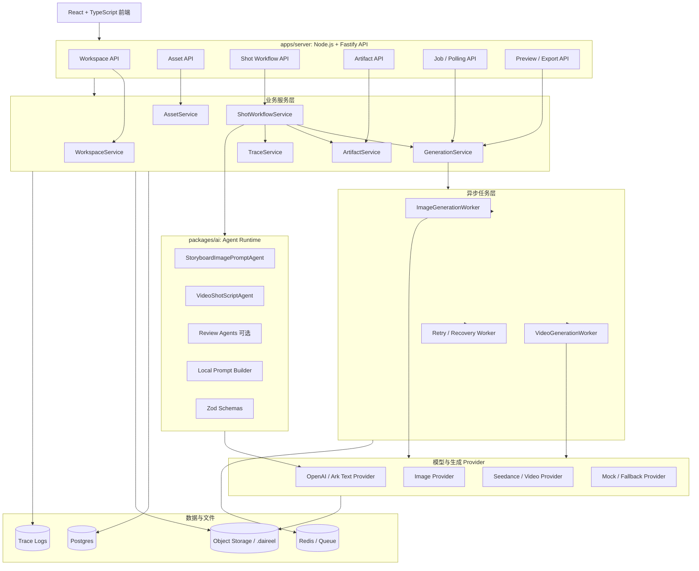
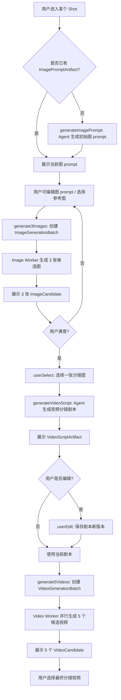
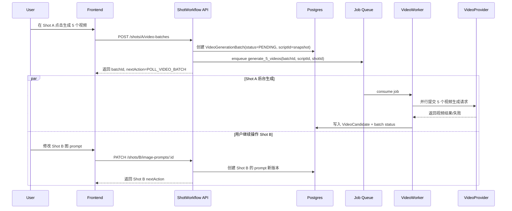
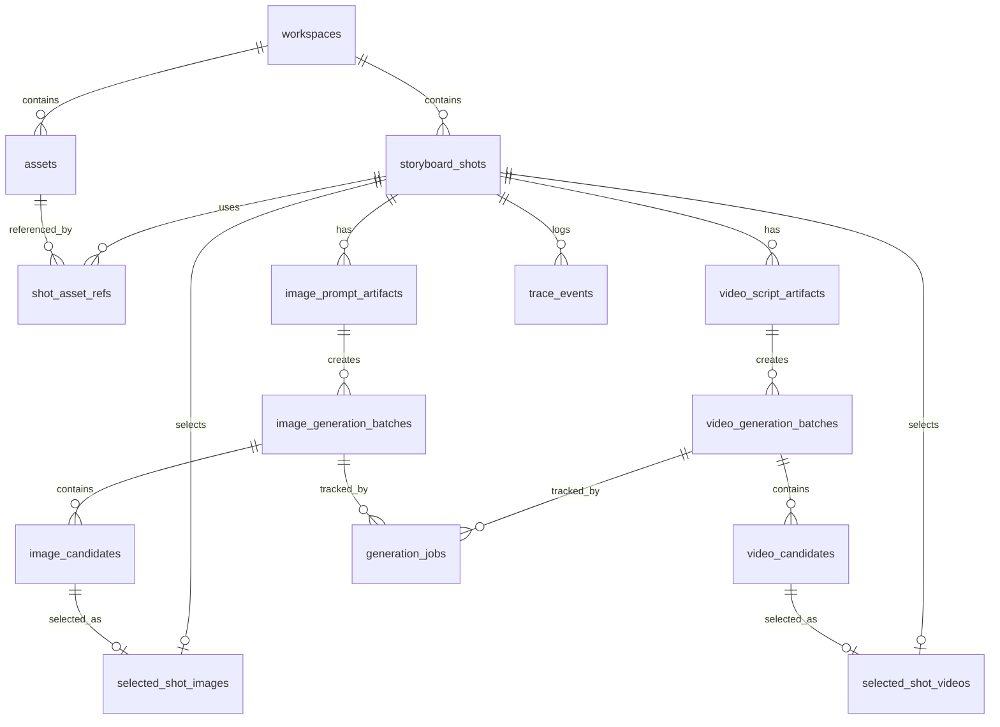
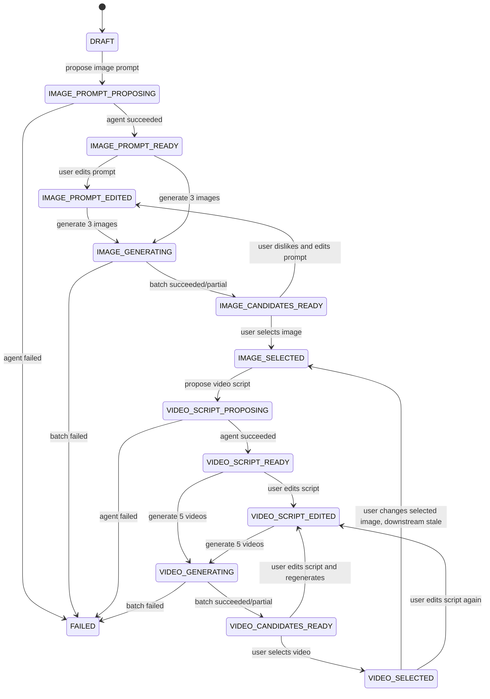
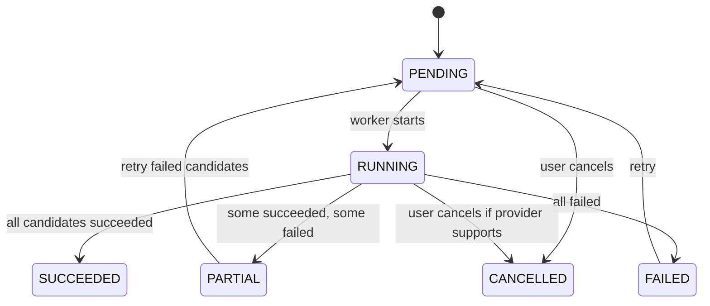

# 分镜图 → 分镜视频工作流设计草案

版本：v0.1  
日期：2026-05-28  
范围：基于现有 `workspace -> material intake -> brief -> storyboard -> shotprompt -> video generate -> preview/export -> feedback route` 主链路，细化“分镜图生成、选择、重生成、视频分镜剧本生成、用户编辑、并行生成分镜视频”的后端设计。

---

## 1. 设计目标

本草案围绕以下用户流程展开：

```txt
generateImagePrompt()
-> generate3Images()
-> userSelect()
-> generateVideoScript()
-> userEdit()
-> generate5Videos()
```

需要满足：

1. 分镜图输入支持文本 prompt 与参考图片。
2. 单次为一个分镜生成 3 张候选图。
3. 用户不满意时，可以修改分镜图 prompt 并再次生成 3 张。
4. 用户选择的分镜图，会作为后续视频分镜剧本的当前帧；同时可结合相邻分镜图作为首尾帧或连续性参考。
5. 初始分镜图 prompt 由商品简介、当前分镜目标、指定商品素材生成。
6. 生成视频分镜剧本后，用户可以编辑剧本。
7. 用户可以基于剧本并行生成 5 个分镜视频候选，剧本中包含用户指定的视频长度。
8. 用户在某个分镜视频生成期间，可以继续设置其他分镜图、视频剧本或提交其他分镜的生成任务。

核心原则：

- **Agent 负责生成结构化内容，不负责控制主流程。**
- **Workflow Service 负责写死步骤顺序、状态推进、版本绑定。**
- **Job Queue 负责长任务和并行任务。**
- **数据库负责 artifact 版本、候选批次、用户选择、任务状态的可恢复存储。**
- **前端只消费 `status` 与 `nextAction`，不猜测流程。**

---

## 2. 后端模块设计图

### 2.1 模块总览



### 2.2 后端模块职责

| 模块 | 职责 | 不负责 |
|---|---|---|
| `workspace` | 工作区创建、恢复、状态聚合 | 具体图/视频生成 |
| `asset` | 商品图、参考图、视频素材上传、校验、URL 签发 | Prompt 生成逻辑 |
| `shot` | 分镜卡片、分镜状态机、nextAction、用户选择 | 直接调用外部模型 |
| `artifact` | 保存 prompt、剧本、结构化 JSON、版本历史、stale 标记 | 业务流程判断 |
| `agent-runtime` | 运行 Agent、加载本地 prompt、Zod 校验输出 | 保存业务状态 |
| `generation` | 创建图像/视频生成 batch，提交 job，聚合结果 | 生成剧本文案 |
| `job` | 任务入队、polling、retry、失败恢复 | 具体业务语义判断 |
| `trace` | 记录 agent/tool/provider/job 事件，供前端展示 | 参与主流程决策 |
| `preview/export` | 媒体文件归档、预览 URL、下载导出 | 修改已批准 prompt |

### 2.3 推荐目录结构

```txt
apps/server/src/modules/
  workspace/
    workspace.routes.ts
    workspace.service.ts
    workspace.repository.ts

  asset/
    asset.routes.ts
    asset.service.ts
    asset.repository.ts
    asset.validator.ts

  shot/
    shot.routes.ts
    shot.workflow.ts
    shot.state.ts
    shot.repository.ts
    shot.next-action.ts

  artifact/
    artifact.service.ts
    artifact.repository.ts
    artifact.versioning.ts
    artifact.stale.ts

  generation/
    generation.routes.ts
    generation.service.ts
    image.provider.ts
    video.provider.ts
    image.worker.ts
    video.worker.ts
    retry.worker.ts

  job/
    job.queue.ts
    job.repository.ts
    job.polling.ts

  trace/
    trace.service.ts
    trace.repository.ts

packages/ai/
  agents/
    storyboard-image-prompt.agent.ts
    video-shot-script.agent.ts
    image-prompt-review.agent.ts
    video-script-review.agent.ts
    prompt-repair.agent.ts

  prompts/
    shared/
      ecommerce-video.system.md
      safety-rules.md
      output-rules.md
    storyboard-image-prompt/
      v1.system.md
    video-shot-script/
      v1.system.md

  schemas/
    storyboard-image-prompt.schema.ts
    video-shot-script.schema.ts
    review.schema.ts

  runtime/
    run-agent.ts
    prompt-builder.ts
    trace-adapter.ts
```

---

## 3. 核心流程设计

### 3.1 主流程图



### 3.2 异步并发原则



关键点：

- 视频生成 job 必须绑定 `scriptId`，不能只绑定 `shotId`。
- 图像生成 job 必须绑定 `imagePromptArtifactId`。
- 用户在 job 运行期间编辑新版本，不影响已提交 batch。
- 当上游 artifact 变化时，下游 artifact 只标记 `STALE`，不物理删除。
- 每个 shot 独立推进状态，一个 shot 的生成中状态不阻塞其他 shot。

---

## 4. 数据库表结构草案

以下以 PostgreSQL 为目标，字段命名用 `snake_case`，JSON 字段用 `jsonb`。

### 4.1 ER 图



### 4.2 枚举建议

```sql
CREATE TYPE shot_status AS ENUM (
  'DRAFT',
  'IMAGE_PROMPT_PROPOSING',
  'IMAGE_PROMPT_READY',
  'IMAGE_PROMPT_EDITED',
  'IMAGE_GENERATING',
  'IMAGE_CANDIDATES_READY',
  'IMAGE_SELECTED',
  'VIDEO_SCRIPT_PROPOSING',
  'VIDEO_SCRIPT_READY',
  'VIDEO_SCRIPT_EDITED',
  'VIDEO_GENERATING',
  'VIDEO_CANDIDATES_READY',
  'VIDEO_SELECTED',
  'FAILED'
);

CREATE TYPE artifact_status AS ENUM (
  'DRAFT',
  'ACTIVE',
  'APPROVED',
  'STALE',
  'ARCHIVED'
);

CREATE TYPE batch_status AS ENUM (
  'PENDING',
  'RUNNING',
  'SUCCEEDED',
  'PARTIAL',
  'FAILED',
  'CANCELLED'
);

CREATE TYPE job_status AS ENUM (
  'PENDING',
  'RUNNING',
  'SUCCEEDED',
  'FAILED',
  'RETRYING',
  'CANCELLED'
);

CREATE TYPE candidate_status AS ENUM (
  'PENDING',
  'RUNNING',
  'SUCCEEDED',
  'FAILED',
  'REJECTED'
);
```

### 4.3 核心表

#### 4.3.1 `storyboard_shots`

用于保存每个分镜卡片的业务状态。

```sql
CREATE TABLE storyboard_shots (
  id UUID PRIMARY KEY,
  workspace_id UUID NOT NULL REFERENCES workspaces(id),
  storyboard_artifact_id UUID NULL,
  order_index INT NOT NULL,
  title TEXT NOT NULL,
  objective TEXT NULL,
  scene_description TEXT NULL,
  voiceover TEXT NULL,
  default_duration_sec NUMERIC(4, 1) NULL,
  status shot_status NOT NULL DEFAULT 'DRAFT',
  next_action TEXT NULL,
  active_image_prompt_artifact_id UUID NULL,
  selected_image_id UUID NULL,
  active_video_script_artifact_id UUID NULL,
  selected_video_id UUID NULL,
  last_error TEXT NULL,
  created_at TIMESTAMPTZ NOT NULL DEFAULT now(),
  updated_at TIMESTAMPTZ NOT NULL DEFAULT now(),
  UNIQUE (workspace_id, order_index)
);

CREATE INDEX idx_storyboard_shots_workspace ON storyboard_shots(workspace_id);
CREATE INDEX idx_storyboard_shots_status ON storyboard_shots(status);
```

#### 4.3.2 `shot_asset_refs`

记录某个分镜使用了哪些商品素材或参考素材。

```sql
CREATE TABLE shot_asset_refs (
  id UUID PRIMARY KEY,
  shot_id UUID NOT NULL REFERENCES storyboard_shots(id),
  asset_id UUID NOT NULL REFERENCES assets(id),
  role TEXT NOT NULL, -- product_identity | reference_style | reference_scene | first_frame_hint | other
  weight NUMERIC(4, 2) NOT NULL DEFAULT 1.0,
  created_at TIMESTAMPTZ NOT NULL DEFAULT now(),
  UNIQUE (shot_id, asset_id, role)
);

CREATE INDEX idx_shot_asset_refs_shot ON shot_asset_refs(shot_id);
CREATE INDEX idx_shot_asset_refs_asset ON shot_asset_refs(asset_id);
```

#### 4.3.3 `image_prompt_artifacts`

保存分镜图 prompt 版本。用户每次编辑都创建新版本。

```sql
CREATE TABLE image_prompt_artifacts (
  id UUID PRIMARY KEY,
  shot_id UUID NOT NULL REFERENCES storyboard_shots(id),
  version INT NOT NULL,
  status artifact_status NOT NULL DEFAULT 'ACTIVE',
  prompt_text TEXT NOT NULL,
  negative_prompt TEXT NULL,
  reference_asset_ids UUID[] NOT NULL DEFAULT '{}',
  prompt_json JSONB NOT NULL DEFAULT '{}'::jsonb,
  created_by TEXT NOT NULL, -- agent | user | system
  agent_name TEXT NULL,
  prompt_template_version TEXT NULL,
  base_artifact_id UUID NULL REFERENCES image_prompt_artifacts(id),
  created_at TIMESTAMPTZ NOT NULL DEFAULT now(),
  UNIQUE (shot_id, version)
);

CREATE INDEX idx_image_prompt_artifacts_shot ON image_prompt_artifacts(shot_id);
CREATE INDEX idx_image_prompt_artifacts_status ON image_prompt_artifacts(status);
```

#### 4.3.4 `image_generation_batches`

一次生成 3 张图，对应一个 batch。

```sql
CREATE TABLE image_generation_batches (
  id UUID PRIMARY KEY,
  workspace_id UUID NOT NULL REFERENCES workspaces(id),
  shot_id UUID NOT NULL REFERENCES storyboard_shots(id),
  image_prompt_artifact_id UUID NOT NULL REFERENCES image_prompt_artifacts(id),
  status batch_status NOT NULL DEFAULT 'PENDING',
  requested_count INT NOT NULL DEFAULT 3,
  succeeded_count INT NOT NULL DEFAULT 0,
  failed_count INT NOT NULL DEFAULT 0,
  provider TEXT NOT NULL,
  provider_request JSONB NOT NULL DEFAULT '{}'::jsonb,
  error_message TEXT NULL,
  idempotency_key TEXT NULL,
  created_at TIMESTAMPTZ NOT NULL DEFAULT now(),
  updated_at TIMESTAMPTZ NOT NULL DEFAULT now(),
  UNIQUE (idempotency_key)
);

CREATE INDEX idx_image_batches_shot ON image_generation_batches(shot_id);
CREATE INDEX idx_image_batches_status ON image_generation_batches(status);
```

#### 4.3.5 `image_candidates`

保存单张候选分镜图。

```sql
CREATE TABLE image_candidates (
  id UUID PRIMARY KEY,
  batch_id UUID NOT NULL REFERENCES image_generation_batches(id),
  workspace_id UUID NOT NULL REFERENCES workspaces(id),
  shot_id UUID NOT NULL REFERENCES storyboard_shots(id),
  image_url TEXT NULL,
  object_key TEXT NULL,
  width INT NULL,
  height INT NULL,
  provider TEXT NOT NULL,
  provider_response JSONB NOT NULL DEFAULT '{}'::jsonb,
  seed TEXT NULL,
  status candidate_status NOT NULL DEFAULT 'PENDING',
  error_message TEXT NULL,
  created_at TIMESTAMPTZ NOT NULL DEFAULT now()
);

CREATE INDEX idx_image_candidates_batch ON image_candidates(batch_id);
CREATE INDEX idx_image_candidates_shot ON image_candidates(shot_id);
```

#### 4.3.6 `selected_shot_images`

保存用户当前选择的分镜图。

```sql
CREATE TABLE selected_shot_images (
  id UUID PRIMARY KEY,
  shot_id UUID NOT NULL UNIQUE REFERENCES storyboard_shots(id),
  image_candidate_id UUID NOT NULL REFERENCES image_candidates(id),
  image_generation_batch_id UUID NOT NULL REFERENCES image_generation_batches(id),
  selected_by UUID NULL,
  selected_at TIMESTAMPTZ NOT NULL DEFAULT now()
);
```

#### 4.3.7 `video_script_artifacts`

保存视频分镜剧本版本。用户编辑也创建新版本。

```sql
CREATE TABLE video_script_artifacts (
  id UUID PRIMARY KEY,
  shot_id UUID NOT NULL REFERENCES storyboard_shots(id),
  version INT NOT NULL,
  status artifact_status NOT NULL DEFAULT 'ACTIVE',
  duration_sec NUMERIC(4, 1) NOT NULL,
  script_json JSONB NOT NULL,
  provider_prompt TEXT NOT NULL,
  based_on_image_candidate_id UUID NOT NULL REFERENCES image_candidates(id),
  based_on_prev_image_candidate_id UUID NULL REFERENCES image_candidates(id),
  based_on_next_image_candidate_id UUID NULL REFERENCES image_candidates(id),
  created_by TEXT NOT NULL, -- agent | user | system
  agent_name TEXT NULL,
  prompt_template_version TEXT NULL,
  base_artifact_id UUID NULL REFERENCES video_script_artifacts(id),
  created_at TIMESTAMPTZ NOT NULL DEFAULT now(),
  UNIQUE (shot_id, version)
);

CREATE INDEX idx_video_script_artifacts_shot ON video_script_artifacts(shot_id);
CREATE INDEX idx_video_script_artifacts_status ON video_script_artifacts(status);
```

#### 4.3.8 `video_generation_batches`

一次并行生成 5 个视频候选。

```sql
CREATE TABLE video_generation_batches (
  id UUID PRIMARY KEY,
  workspace_id UUID NOT NULL REFERENCES workspaces(id),
  shot_id UUID NOT NULL REFERENCES storyboard_shots(id),
  video_script_artifact_id UUID NOT NULL REFERENCES video_script_artifacts(id),
  status batch_status NOT NULL DEFAULT 'PENDING',
  requested_count INT NOT NULL DEFAULT 5,
  succeeded_count INT NOT NULL DEFAULT 0,
  failed_count INT NOT NULL DEFAULT 0,
  provider TEXT NOT NULL,
  provider_request JSONB NOT NULL DEFAULT '{}'::jsonb,
  error_message TEXT NULL,
  idempotency_key TEXT NULL,
  created_at TIMESTAMPTZ NOT NULL DEFAULT now(),
  updated_at TIMESTAMPTZ NOT NULL DEFAULT now(),
  UNIQUE (idempotency_key)
);

CREATE INDEX idx_video_batches_shot ON video_generation_batches(shot_id);
CREATE INDEX idx_video_batches_status ON video_generation_batches(status);
```

#### 4.3.9 `video_candidates`

保存单个候选分镜视频。

```sql
CREATE TABLE video_candidates (
  id UUID PRIMARY KEY,
  batch_id UUID NOT NULL REFERENCES video_generation_batches(id),
  workspace_id UUID NOT NULL REFERENCES workspaces(id),
  shot_id UUID NOT NULL REFERENCES storyboard_shots(id),
  video_url TEXT NULL,
  object_key TEXT NULL,
  thumbnail_url TEXT NULL,
  duration_sec NUMERIC(4, 1) NULL,
  width INT NULL,
  height INT NULL,
  provider TEXT NOT NULL,
  provider_response JSONB NOT NULL DEFAULT '{}'::jsonb,
  status candidate_status NOT NULL DEFAULT 'PENDING',
  error_message TEXT NULL,
  created_at TIMESTAMPTZ NOT NULL DEFAULT now()
);

CREATE INDEX idx_video_candidates_batch ON video_candidates(batch_id);
CREATE INDEX idx_video_candidates_shot ON video_candidates(shot_id);
```

#### 4.3.10 `selected_shot_videos`

保存用户最终选择的分镜视频。

```sql
CREATE TABLE selected_shot_videos (
  id UUID PRIMARY KEY,
  shot_id UUID NOT NULL UNIQUE REFERENCES storyboard_shots(id),
  video_candidate_id UUID NOT NULL REFERENCES video_candidates(id),
  video_generation_batch_id UUID NOT NULL REFERENCES video_generation_batches(id),
  selected_by UUID NULL,
  selected_at TIMESTAMPTZ NOT NULL DEFAULT now()
);
```

#### 4.3.11 `generation_jobs`

统一记录图片/视频生成任务，用于 polling、retry、恢复。

```sql
CREATE TABLE generation_jobs (
  id UUID PRIMARY KEY,
  workspace_id UUID NOT NULL REFERENCES workspaces(id),
  shot_id UUID NULL REFERENCES storyboard_shots(id),
  job_type TEXT NOT NULL, -- generate_3_images | generate_5_videos | final_video | export_video
  status job_status NOT NULL DEFAULT 'PENDING',
  queue_name TEXT NOT NULL,
  queue_job_id TEXT NULL,
  related_batch_type TEXT NULL, -- image_generation_batch | video_generation_batch
  related_batch_id UUID NULL,
  payload JSONB NOT NULL DEFAULT '{}'::jsonb,
  progress NUMERIC(5, 2) NOT NULL DEFAULT 0,
  attempt_count INT NOT NULL DEFAULT 0,
  max_attempts INT NOT NULL DEFAULT 3,
  error_message TEXT NULL,
  started_at TIMESTAMPTZ NULL,
  completed_at TIMESTAMPTZ NULL,
  created_at TIMESTAMPTZ NOT NULL DEFAULT now(),
  updated_at TIMESTAMPTZ NOT NULL DEFAULT now()
);

CREATE INDEX idx_generation_jobs_workspace ON generation_jobs(workspace_id);
CREATE INDEX idx_generation_jobs_status ON generation_jobs(status);
CREATE INDEX idx_generation_jobs_related_batch ON generation_jobs(related_batch_type, related_batch_id);
```

#### 4.3.12 `trace_events`

用于前端 Trace / Prompt Preview / Debug 面板。

```sql
CREATE TABLE trace_events (
  id UUID PRIMARY KEY,
  workspace_id UUID NOT NULL REFERENCES workspaces(id),
  shot_id UUID NULL REFERENCES storyboard_shots(id),
  trace_type TEXT NOT NULL, -- agent_run | provider_call | job_event | state_transition | user_action
  name TEXT NOT NULL,
  input_preview TEXT NULL,
  output_preview TEXT NULL,
  metadata JSONB NOT NULL DEFAULT '{}'::jsonb,
  created_at TIMESTAMPTZ NOT NULL DEFAULT now()
);

CREATE INDEX idx_trace_events_workspace ON trace_events(workspace_id, created_at DESC);
CREATE INDEX idx_trace_events_shot ON trace_events(shot_id, created_at DESC);
```

---

## 5. Agent 划分方案

### 5.1 Agent 清单

| Agent | 阶段 | 输入 | 输出 | P0/P1 建议 |
|---|---|---|---|---|
| `StoryboardImagePromptAgent` | 分镜图 prompt 生成 | 商品 brief、shot 目标、素材列表、参考图角色、风格要求 | `ImagePromptArtifact` 结构化 JSON | P0 必做 |
| `ImagePromptReviewAgent` | 分镜图 prompt 自审阅 | prompt、商品信息、约束 | 是否通过、风险、修复建议 | P1 可做，P0 可用规则替代 |
| `VideoShotScriptAgent` | 视频分镜剧本生成 | 当前选中图、相邻图、商品 brief、shot 目标、时长 | `VideoScriptArtifact` 结构化 JSON + `providerPrompt` | P0 必做 |
| `VideoScriptReviewAgent` | 视频剧本自审阅 | 视频剧本、providerPrompt、时长、图片绑定 | 是否通过、问题列表、修复建议 | P1 建议 |
| `PromptRepairAgent` | 局部修复 | 原 prompt/剧本 + 用户反馈/审阅问题 | 修复后的 prompt/剧本 | P1 建议 |
| `TraceSummaryAgent` | Trace 总结 | trace events | 前端展示摘要 | P2 可选 |

### 5.2 Agent 与工程边界

| 能力 | 放在 Agent | 放在代码/服务 |
|---|---|---|
| 根据商品信息生成分镜图 prompt | 是 | 否 |
| 根据相邻帧生成视频剧本 | 是 | 否 |
| 判断下一步应该做什么 | 否 | 是，`ShotWorkflowService` |
| 保存 artifact 版本 | 否 | 是，`ArtifactService` |
| 创建 3 图/5 视频 batch | 否 | 是，`GenerationService` |
| 并行生成 5 个视频 | 否 | 是，`VideoWorker` |
| 最终成片 prompt 编译 | 否 | 是，确定性 compiler |
| 用户选择和用户编辑 | 否 | 是，业务 API |

### 5.3 输出 Schema 建议

#### `StoryboardImagePromptOutput`

```ts
export const StoryboardImagePromptSchema = z.object({
  promptText: z.string().min(20),
  negativePrompt: z.string().optional(),
  visualStyle: z.string().optional(),
  composition: z.string().optional(),
  lighting: z.string().optional(),
  productVisibilityRule: z.string(),
  referenceImageUsage: z.array(z.object({
    assetId: z.string(),
    usage: z.enum([
      'product_identity',
      'style_reference',
      'scene_reference',
      'composition_reference'
    ]),
    instruction: z.string()
  })).default([]),
  qualityChecklist: z.array(z.string()).default([])
});
```

#### `VideoShotScriptOutput`

```ts
export const VideoShotScriptSchema = z.object({
  durationSec: z.number().min(1).max(8),
  shotGoal: z.string(),
  startFrameDescription: z.string(),
  endFrameDescription: z.string(),
  continuityWithPrevious: z.string().optional(),
  continuityWithNext: z.string().optional(),
  cameraMotion: z.string(),
  subjectMotion: z.string(),
  productVisibility: z.string(),
  sceneConsistency: z.string(),
  voiceover: z.string().optional(),
  onscreenText: z.string().optional(),
  providerPrompt: z.string().min(30),
  negativePrompt: z.string().optional(),
  riskNotes: z.array(z.string()).default([])
});
```

### 5.4 Agent 输入快照

每次 Agent 运行，都应该保存输入快照，便于复现：

```ts
interface AgentRunSnapshot {
  workspaceId: string;
  shotId: string;
  agentName: string;
  promptTemplateVersion: string;
  input: unknown;
  output: unknown;
  traceId?: string;
  createdAt: string;
}
```

---

## 6. API 设计

### 6.1 通用响应结构

所有推进流程的 API 都建议返回：

```ts
interface WorkflowResponse<T> {
  data: T;
  shotStatus: ShotStatus;
  nextAction: NextAction;
  warnings?: string[];
  traceId?: string;
}
```

`nextAction` 建议统一枚举：

```ts
type NextAction =
  | 'GENERATE_IMAGE_PROMPT'
  | 'EDIT_IMAGE_PROMPT'
  | 'GENERATE_3_IMAGES'
  | 'POLL_IMAGE_BATCH'
  | 'SELECT_IMAGE'
  | 'GENERATE_VIDEO_SCRIPT'
  | 'EDIT_VIDEO_SCRIPT'
  | 'GENERATE_5_VIDEOS'
  | 'POLL_VIDEO_BATCH'
  | 'SELECT_VIDEO'
  | 'READY_FOR_FINAL_COMPOSE'
  | 'RETRY'
  | 'NONE';
```

---

### 6.2 生成初始分镜图 Prompt

```http
POST /api/workspaces/:workspaceId/shots/:shotId/image-prompts/propose
```

请求：

```json
{
  "referenceAssetIds": ["asset-1", "asset-2"],
  "userHint": "希望画面更像小红书生活方式种草图",
  "stylePresetId": "lifestyle_ugc_v1"
}
```

服务端逻辑：

1. 读取 workspace、product brief、shot、素材摘要。
2. 调用 `StoryboardImagePromptAgent`。
3. 用 Zod 校验输出。
4. 创建 `image_prompt_artifacts` 新版本。
5. 更新 `storyboard_shots.status = IMAGE_PROMPT_READY`。
6. 返回 `nextAction = GENERATE_3_IMAGES`。

响应：

```json
{
  "data": {
    "artifactId": "image-prompt-artifact-1",
    "version": 1,
    "promptText": "...",
    "negativePrompt": "...",
    "referenceAssetIds": ["asset-1", "asset-2"]
  },
  "shotStatus": "IMAGE_PROMPT_READY",
  "nextAction": "GENERATE_3_IMAGES"
}
```

---

### 6.3 用户编辑分镜图 Prompt

```http
PATCH /api/shots/:shotId/image-prompts/:artifactId
```

请求：

```json
{
  "promptText": "新的分镜图 prompt...",
  "negativePrompt": "避免文字变形、商品 logo 错误",
  "referenceAssetIds": ["asset-1"]
}
```

服务端逻辑：

1. 读取原 artifact。
2. 创建新版本，`created_by = user`，`base_artifact_id = artifactId`。
3. 原最新图候选 batch 可保留，但如果 prompt 发生变化，下游图候选不自动复用。
4. 更新 `storyboard_shots.active_image_prompt_artifact_id`。
5. 如果已经存在视频剧本或视频候选，标记为 `STALE`。

响应：

```json
{
  "data": {
    "artifactId": "image-prompt-artifact-2",
    "version": 2
  },
  "shotStatus": "IMAGE_PROMPT_EDITED",
  "nextAction": "GENERATE_3_IMAGES",
  "warnings": ["图 prompt 已变化，原视频剧本将被标记为 stale"]
}
```

---

### 6.4 生成 3 张分镜图

```http
POST /api/shots/:shotId/image-batches
```

请求：

```json
{
  "imagePromptArtifactId": "image-prompt-artifact-2",
  "count": 3,
  "aspectRatio": "9:16"
}
```

服务端逻辑：

1. 验证 `imagePromptArtifactId` 属于当前 shot。
2. 创建 `image_generation_batches`，状态为 `PENDING`。
3. 创建 `generation_jobs`。
4. 入队 `generate_3_images`。
5. 更新 shot 状态为 `IMAGE_GENERATING`。
6. 立即返回 batchId。

响应：

```json
{
  "data": {
    "batchId": "image-batch-1",
    "jobId": "job-1",
    "status": "PENDING"
  },
  "shotStatus": "IMAGE_GENERATING",
  "nextAction": "POLL_IMAGE_BATCH"
}
```

---

### 6.5 查询分镜图 Batch

```http
GET /api/shots/:shotId/image-batches/:batchId
```

响应：

```json
{
  "data": {
    "batchId": "image-batch-1",
    "status": "SUCCEEDED",
    "candidates": [
      {
        "id": "image-candidate-1",
        "imageUrl": "https://.../1.png",
        "status": "SUCCEEDED"
      },
      {
        "id": "image-candidate-2",
        "imageUrl": "https://.../2.png",
        "status": "SUCCEEDED"
      },
      {
        "id": "image-candidate-3",
        "imageUrl": "https://.../3.png",
        "status": "SUCCEEDED"
      }
    ]
  },
  "shotStatus": "IMAGE_CANDIDATES_READY",
  "nextAction": "SELECT_IMAGE"
}
```

---

### 6.6 用户选择分镜图

```http
POST /api/shots/:shotId/selected-image
```

请求：

```json
{
  "imageCandidateId": "image-candidate-2",
  "imageGenerationBatchId": "image-batch-1"
}
```

服务端逻辑：

1. 校验候选图属于当前 shot 且状态成功。
2. upsert `selected_shot_images`。
3. 更新 `storyboard_shots.selected_image_id`。
4. 如果选择变化，则将当前 shot 已有 `video_script_artifacts` 与 `video_generation_batches` 标记为 `STALE`。
5. 更新状态为 `IMAGE_SELECTED`。

响应：

```json
{
  "data": {
    "selectedImageId": "image-candidate-2"
  },
  "shotStatus": "IMAGE_SELECTED",
  "nextAction": "GENERATE_VIDEO_SCRIPT"
}
```

---

### 6.7 生成视频分镜剧本

```http
POST /api/workspaces/:workspaceId/shots/:shotId/video-scripts/propose
```

请求：

```json
{
  "durationSec": 4,
  "useNeighborFrames": true,
  "userHint": "镜头要有从产品到人物使用场景的轻微推进"
}
```

服务端逻辑：

1. 读取当前 shot 选择的图。
2. 查询前后相邻 shot 的 selected image。如果没有，不阻塞生成，只作为缺省项处理。
3. 读取 product brief、storyboard shot、shotprompt 上下文。
4. 调用 `VideoShotScriptAgent`。
5. 校验输出 schema。
6. 创建 `video_script_artifacts`。
7. 更新状态为 `VIDEO_SCRIPT_READY`。

响应：

```json
{
  "data": {
    "scriptId": "video-script-1",
    "version": 1,
    "durationSec": 4,
    "scriptJson": {
      "shotGoal": "展示产品使用场景",
      "cameraMotion": "轻微推进",
      "subjectMotion": "人物拿起产品并靠近镜头"
    },
    "providerPrompt": "..."
  },
  "shotStatus": "VIDEO_SCRIPT_READY",
  "nextAction": "EDIT_VIDEO_SCRIPT"
}
```

---

### 6.8 用户编辑视频剧本

```http
PATCH /api/shots/:shotId/video-scripts/:scriptId
```

请求：

```json
{
  "durationSec": 5,
  "scriptJson": {
    "shotGoal": "强化产品卖点",
    "cameraMotion": "缓慢推近",
    "subjectMotion": "手部展示产品细节",
    "voiceover": "这一款更适合日常通勤使用"
  },
  "providerPrompt": "基于用户编辑后的最终视频分镜 prompt..."
}
```

服务端逻辑：

1. 读取原 script artifact。
2. 创建新版本，`created_by = user`。
3. 绑定原来的 `based_on_image_candidate_id / prev / next`。
4. 如果已有视频 batch，标记旧 batch 为历史结果，不影响新剧本。
5. 更新状态为 `VIDEO_SCRIPT_EDITED`。

响应：

```json
{
  "data": {
    "scriptId": "video-script-2",
    "version": 2
  },
  "shotStatus": "VIDEO_SCRIPT_EDITED",
  "nextAction": "GENERATE_5_VIDEOS"
}
```

---

### 6.9 并行生成 5 个分镜视频

```http
POST /api/shots/:shotId/video-batches
```

请求：

```json
{
  "videoScriptArtifactId": "video-script-2",
  "count": 5,
  "aspectRatio": "9:16"
}
```

服务端逻辑：

1. 校验 script 属于当前 shot，且没有 stale。
2. 读取 `based_on_image_candidate_id` 对应的当前帧。
3. 创建 `video_generation_batches`，状态为 `PENDING`。
4. 创建 `generation_jobs`。
5. 入队 `generate_5_videos`。
6. Worker 内部用 `Promise.allSettled` 或 provider 原生批量接口并行生成。
7. 单个候选失败不导致整个 batch 失败；只要有成功，batch 为 `PARTIAL` 或 `SUCCEEDED`。
8. 更新 shot 状态为 `VIDEO_GENERATING`。

响应：

```json
{
  "data": {
    "batchId": "video-batch-1",
    "jobId": "job-2",
    "status": "PENDING"
  },
  "shotStatus": "VIDEO_GENERATING",
  "nextAction": "POLL_VIDEO_BATCH"
}
```

---

### 6.10 查询分镜视频 Batch

```http
GET /api/shots/:shotId/video-batches/:batchId
```

响应：

```json
{
  "data": {
    "batchId": "video-batch-1",
    "status": "PARTIAL",
    "succeededCount": 4,
    "failedCount": 1,
    "candidates": [
      {
        "id": "video-candidate-1",
        "videoUrl": "https://.../1.mp4",
        "thumbnailUrl": "https://.../1.jpg",
        "durationSec": 5,
        "status": "SUCCEEDED"
      },
      {
        "id": "video-candidate-2",
        "status": "FAILED",
        "errorMessage": "provider timeout"
      }
    ]
  },
  "shotStatus": "VIDEO_CANDIDATES_READY",
  "nextAction": "SELECT_VIDEO"
}
```

---

### 6.11 用户选择分镜视频

```http
POST /api/shots/:shotId/selected-video
```

请求：

```json
{
  "videoCandidateId": "video-candidate-1",
  "videoGenerationBatchId": "video-batch-1"
}
```

响应：

```json
{
  "data": {
    "selectedVideoId": "video-candidate-1"
  },
  "shotStatus": "VIDEO_SELECTED",
  "nextAction": "READY_FOR_FINAL_COMPOSE"
}
```

---

### 6.12 工作区级状态聚合

```http
GET /api/workspaces/:workspaceId/shot-workflow-status
```

用途：页面刷新后恢复所有分镜状态。

响应：

```json
{
  "data": {
    "workspaceId": "workspace-1",
    "shots": [
      {
        "shotId": "shot-1",
        "orderIndex": 1,
        "status": "VIDEO_GENERATING",
        "nextAction": "POLL_VIDEO_BATCH",
        "activeImageBatchId": "image-batch-1",
        "activeVideoBatchId": "video-batch-1",
        "selectedImageId": "image-candidate-2",
        "selectedVideoId": null
      },
      {
        "shotId": "shot-2",
        "orderIndex": 2,
        "status": "IMAGE_PROMPT_READY",
        "nextAction": "GENERATE_3_IMAGES"
      }
    ],
    "canComposeFinalVideo": false
  }
}
```

---

## 7. 状态机定义

### 7.1 Shot 状态机



### 7.2 状态与 nextAction 映射

| `shot.status` | `nextAction` | 前端展示 |
|---|---|---|
| `DRAFT` | `GENERATE_IMAGE_PROMPT` | 生成分镜图 prompt |
| `IMAGE_PROMPT_PROPOSING` | `NONE` | Agent 生成中 |
| `IMAGE_PROMPT_READY` | `GENERATE_3_IMAGES` | 展示 prompt，可生成 3 图 |
| `IMAGE_PROMPT_EDITED` | `GENERATE_3_IMAGES` | 展示用户编辑版 prompt，可重新生成 3 图 |
| `IMAGE_GENERATING` | `POLL_IMAGE_BATCH` | 展示图生成进度 |
| `IMAGE_CANDIDATES_READY` | `SELECT_IMAGE` | 展示 3 张图，等待选择 |
| `IMAGE_SELECTED` | `GENERATE_VIDEO_SCRIPT` | 展示已选图，可生成视频剧本 |
| `VIDEO_SCRIPT_PROPOSING` | `NONE` | Agent 生成视频剧本中 |
| `VIDEO_SCRIPT_READY` | `EDIT_VIDEO_SCRIPT` | 展示剧本，可编辑或生成 5 视频 |
| `VIDEO_SCRIPT_EDITED` | `GENERATE_5_VIDEOS` | 展示用户编辑版剧本 |
| `VIDEO_GENERATING` | `POLL_VIDEO_BATCH` | 展示视频生成进度 |
| `VIDEO_CANDIDATES_READY` | `SELECT_VIDEO` | 展示 5 个视频候选 |
| `VIDEO_SELECTED` | `READY_FOR_FINAL_COMPOSE` | 分镜视频已确定 |
| `FAILED` | `RETRY` | 展示失败原因和重试入口 |

### 7.3 Batch 状态机



### 7.4 Stale 规则

| 事件 | 需要标记 stale 的对象 | 原因 |
|---|---|---|
| 用户修改 `image_prompt_artifact` | 旧的 image batch 可保留为历史；后续 video script/video batch stale | 新图 prompt 会影响后续画面 |
| 用户重新选择分镜图 | 当前 shot 的 video script、video batch、selected video stale | 剧本和视频基于旧图 |
| 相邻 shot 的 selected image 变化 | 当前 shot 的 video script 可提示 stale warning | 视频剧本可能依赖相邻图连续性 |
| 用户修改 `video_script_artifact` | 旧的 video batch stale | 旧视频基于旧剧本 |
| 用户修改 durationSec | 旧的 video batch stale | 视频长度和 provider prompt 已变化 |
| 用户重新生成 5 视频 | 不影响剧本，只创建新 batch | 同一剧本下允许多个候选批次 |

### 7.5 版本规则

```txt
image_prompt_artifacts:
  shot_id + version 单调递增
  每次 agent propose 或 user edit 创建新版本
  shot.active_image_prompt_artifact_id 指向当前版本

video_script_artifacts:
  shot_id + version 单调递增
  每次 agent propose 或 user edit 创建新版本
  生成 video batch 时必须显式绑定 video_script_artifact_id

image_generation_batches:
  每次生成 3 图创建新 batch
  batch 永远绑定某个 image_prompt_artifact_id

video_generation_batches:
  每次生成 5 视频创建新 batch
  batch 永远绑定某个 video_script_artifact_id
```

---

## 8. Workflow Service 伪代码

```ts
export class ShotWorkflowService {
  async proposeImagePrompt(input: {
    workspaceId: string;
    shotId: string;
    referenceAssetIds: string[];
    userHint?: string;
    stylePresetId?: string;
  }) {
    const snapshot = await this.buildImagePromptInput(input);
    const output = await this.agentRuntime.runStoryboardImagePromptAgent(snapshot);
    const artifact = await this.artifactService.createImagePromptVersion({
      shotId: input.shotId,
      output,
      referenceAssetIds: input.referenceAssetIds,
      createdBy: 'agent'
    });
    await this.state.transition(input.shotId, 'IMAGE_PROMPT_READY');
    return this.response(artifact, 'IMAGE_PROMPT_READY', 'GENERATE_3_IMAGES');
  }

  async updateImagePrompt(input: {
    shotId: string;
    artifactId: string;
    promptText: string;
    negativePrompt?: string;
    referenceAssetIds: string[];
  }) {
    const artifact = await this.artifactService.createEditedImagePromptVersion(input);
    await this.artifactService.markDownstreamStaleAfterImagePromptChange(input.shotId);
    await this.state.transition(input.shotId, 'IMAGE_PROMPT_EDITED');
    return this.response(artifact, 'IMAGE_PROMPT_EDITED', 'GENERATE_3_IMAGES');
  }

  async enqueueGenerate3Images(input: {
    workspaceId: string;
    shotId: string;
    imagePromptArtifactId: string;
  }) {
    const batch = await this.generationService.createImageBatch(input);
    const job = await this.jobQueue.enqueue('generate_3_images', {
      batchId: batch.id,
      shotId: input.shotId,
      imagePromptArtifactId: input.imagePromptArtifactId
    });
    await this.state.transition(input.shotId, 'IMAGE_GENERATING');
    return this.response({ batchId: batch.id, jobId: job.id }, 'IMAGE_GENERATING', 'POLL_IMAGE_BATCH');
  }

  async selectImage(input: {
    shotId: string;
    imageCandidateId: string;
    imageGenerationBatchId: string;
  }) {
    const selectionChanged = await this.artifactService.selectShotImage(input);
    if (selectionChanged) {
      await this.artifactService.markDownstreamStaleAfterImageSelectionChange(input.shotId);
    }
    await this.state.transition(input.shotId, 'IMAGE_SELECTED');
    return this.response({ selectedImageId: input.imageCandidateId }, 'IMAGE_SELECTED', 'GENERATE_VIDEO_SCRIPT');
  }

  async proposeVideoScript(input: {
    workspaceId: string;
    shotId: string;
    durationSec: number;
    userHint?: string;
  }) {
    const snapshot = await this.buildVideoScriptInput(input);
    const output = await this.agentRuntime.runVideoShotScriptAgent(snapshot);
    const artifact = await this.artifactService.createVideoScriptVersion({
      shotId: input.shotId,
      output,
      durationSec: output.durationSec,
      basedOnImages: snapshot.frames,
      createdBy: 'agent'
    });
    await this.state.transition(input.shotId, 'VIDEO_SCRIPT_READY');
    return this.response(artifact, 'VIDEO_SCRIPT_READY', 'EDIT_VIDEO_SCRIPT');
  }

  async updateVideoScript(input: {
    shotId: string;
    scriptId: string;
    durationSec: number;
    scriptJson: unknown;
    providerPrompt: string;
  }) {
    const artifact = await this.artifactService.createEditedVideoScriptVersion(input);
    await this.artifactService.markVideoBatchesStaleAfterScriptChange(input.shotId);
    await this.state.transition(input.shotId, 'VIDEO_SCRIPT_EDITED');
    return this.response(artifact, 'VIDEO_SCRIPT_EDITED', 'GENERATE_5_VIDEOS');
  }

  async enqueueGenerate5Videos(input: {
    workspaceId: string;
    shotId: string;
    videoScriptArtifactId: string;
  }) {
    const batch = await this.generationService.createVideoBatch(input);
    const job = await this.jobQueue.enqueue('generate_5_videos', {
      batchId: batch.id,
      shotId: input.shotId,
      videoScriptArtifactId: input.videoScriptArtifactId
    });
    await this.state.transition(input.shotId, 'VIDEO_GENERATING');
    return this.response({ batchId: batch.id, jobId: job.id }, 'VIDEO_GENERATING', 'POLL_VIDEO_BATCH');
  }
}
```

---

## 9. Worker 设计

### 9.1 `ImageGenerationWorker`

```ts
async function processGenerate3Images(job: Generate3ImagesJob) {
  const batch = await db.imageGenerationBatches.get(job.batchId);
  const artifact = await db.imagePromptArtifacts.get(job.imagePromptArtifactId);

  await db.imageGenerationBatches.updateStatus(batch.id, 'RUNNING');

  const results = await imageProvider.generateImages({
    prompt: artifact.promptText,
    negativePrompt: artifact.negativePrompt,
    referenceImageUrls: await assetService.getUrls(artifact.referenceAssetIds),
    count: 3,
    aspectRatio: '9:16'
  });

  for (const result of results) {
    await db.imageCandidates.create({
      batchId: batch.id,
      shotId: batch.shotId,
      imageUrl: result.imageUrl,
      provider: result.provider,
      seed: result.seed,
      status: 'SUCCEEDED'
    });
  }

  await generationService.completeImageBatch(batch.id);
  await shotState.transition(batch.shotId, 'IMAGE_CANDIDATES_READY');
}
```

### 9.2 `VideoGenerationWorker`

```ts
async function processGenerate5Videos(job: Generate5VideosJob) {
  const batch = await db.videoGenerationBatches.get(job.batchId);
  const script = await db.videoScriptArtifacts.get(job.videoScriptArtifactId);
  const startImage = await db.imageCandidates.get(script.basedOnImageCandidateId);
  const endImage = script.basedOnNextImageCandidateId
    ? await db.imageCandidates.get(script.basedOnNextImageCandidateId)
    : undefined;

  await db.videoGenerationBatches.updateStatus(batch.id, 'RUNNING');

  const tasks = Array.from({ length: 5 }, () => videoProvider.generateVideo({
    providerPrompt: script.providerPrompt,
    startFrameUrl: startImage.imageUrl,
    endFrameUrl: endImage?.imageUrl,
    durationSec: script.durationSec,
    aspectRatio: '9:16'
  }));

  const results = await Promise.allSettled(tasks);

  for (const result of results) {
    if (result.status === 'fulfilled') {
      await db.videoCandidates.create({
        batchId: batch.id,
        shotId: batch.shotId,
        videoUrl: result.value.videoUrl,
        thumbnailUrl: result.value.thumbnailUrl,
        durationSec: result.value.durationSec,
        provider: result.value.provider,
        status: 'SUCCEEDED'
      });
    } else {
      await db.videoCandidates.create({
        batchId: batch.id,
        shotId: batch.shotId,
        provider: 'seedance',
        status: 'FAILED',
        errorMessage: result.reason?.message ?? 'Unknown provider error'
      });
    }
  }

  await generationService.completeVideoBatch(batch.id);
  await shotState.transition(batch.shotId, 'VIDEO_CANDIDATES_READY');
}
```

---

## 10. 前端页面协作建议

### 10.1 Shot Card 展示区域

每个 shot card 建议包含：

- 分镜基础信息：序号、标题、目标、默认时长。
- 图 prompt 区：当前 prompt、参考图、编辑按钮。
- 图候选区：当前 batch 的 3 张图、历史 batch 切换。
- 已选图：明确标识。
- 视频剧本区：结构化字段编辑器、provider prompt preview。
- 视频候选区：当前 batch 的 5 个视频、进度、失败提示。
- Trace 区：最近 agent/provider/job 事件。

### 10.2 Workspace 级汇总

- 展示所有 shot 的状态。
- 标识哪些 shot 已选图、已生成剧本、已选视频。
- 当所有必要 shot 都 `VIDEO_SELECTED` 后，显示“一键成片”。
- 如果某个 shot 存在 stale 下游结果，显示“建议重新生成”。

---

## 11. 失败、重试与恢复

### 11.1 失败类型

| 类型 | 示例 | 处理 |
|---|---|---|
| Agent 失败 | schema 不合法、超时 | 重试 agent，或保留用户手动编辑入口 |
| Image Provider 失败 | 3 张图全失败 | batch failed，允许重试 |
| Image Provider 部分失败 | 3 张中 2 张成功 | batch partial，可选择成功图，也可重试 |
| Video Provider 失败 | 5 个视频全失败 | batch failed，允许重试 |
| Video Provider 部分失败 | 5 个视频中 3 个成功 | batch partial，可选择成功视频，也可补生成 |
| 用户修改上游 | prompt/选图/剧本变化 | 标记下游 stale，不删除历史 |
| 页面刷新 | 用户离开再回来 | 通过 workspace status API 恢复 |

### 11.2 Retry 规则

- 重试图生成：复用同一个 `image_prompt_artifact_id`，创建新 `image_generation_batch`。
- 重试视频生成：复用同一个 `video_script_artifact_id`，创建新 `video_generation_batch`。
- 补生成失败候选：P1 可做，P0 可以直接重新生成完整 batch。
- Provider 不稳定时：支持 `MockProvider` 或 `FallbackProvider`，但要在 trace 中标识 `runtimeMode = mock/fallback`。

### 11.3 幂等性

建议所有创建 batch 的接口支持 `Idempotency-Key`：

```http
Idempotency-Key: workspace-1:shot-2:video-script-5:generate-5-videos:v1
```

避免用户重复点击导致多个重复 batch。

---

## 12. 最终成片衔接

分镜视频工作流完成后，最终成片有两种路径：

### 12.1 P0 简化路径

- 每个 shot 已有 `selected_video_id`。
- 最终成片服务直接按 `order_index` 拼接 selected video。
- 如需全片 prompt，则仍从 approved `ShotPromptArtifact` 或 per-shot `providerPrompt` 确定性编译，不在 export 阶段重新调用文本模型。

### 12.2 P1 增强路径

- 引入 timeline 模型。
- 支持字幕、TTS、BGM、转场。
- 支持局部分镜替换后重新合成。
- 支持 final compose job 的 trace 展示。

---

## 13. 测试用例草案

### 13.1 API 测试

| 用例 | 预期 |
|---|---|
| 生成 image prompt | 创建 artifact v1，nextAction 为 `GENERATE_3_IMAGES` |
| 编辑 image prompt | 创建 artifact v2，旧下游标记 stale |
| 生成 3 图 | 创建 image batch 和 job，状态进入 `IMAGE_GENERATING` |
| 图 batch 成功 | 生成 3 个 image candidates，状态进入 `IMAGE_CANDIDATES_READY` |
| 用户选图 | 写入 selected image，nextAction 为 `GENERATE_VIDEO_SCRIPT` |
| 生成视频剧本 | 创建 video script v1，绑定当前图和相邻图快照 |
| 编辑视频剧本 | 创建 video script v2，旧 video batch stale |
| 生成 5 视频 | 创建 video batch 和 job，状态进入 `VIDEO_GENERATING` |
| 视频部分失败 | batch 为 `PARTIAL`，成功候选可选 |
| 页面刷新恢复 | workspace status 返回所有 shot 的 active batch 和 nextAction |

### 13.2 状态机测试

- 不允许未选图时生成视频剧本。
- 不允许用 stale 的 video script 生成视频，除非用户显式确认。
- 不允许选择失败的 image/video candidate。
- 不允许跨 shot 选择 candidate。
- 已提交 job 必须绑定 artifact snapshot，不能读取最新版本。

### 13.3 E2E 测试

```txt
创建 workspace
-> 上传商品图和参考图
-> 生成 brief/storyboard/shotprompt
-> 进入 shot 1
-> 生成图 prompt
-> 生成 3 张图
-> 选择第 2 张
-> 生成视频剧本
-> 编辑 durationSec 和 providerPrompt
-> 并行生成 5 个视频
-> 切换到 shot 2 并继续生成图 prompt
-> 回到 shot 1，选择一个视频
-> 刷新页面，确认状态恢复
```

---

## 14. P0 / P1 落地建议

### P0 必做

1. `storyboard_shots` 状态机。
2. `image_prompt_artifacts` / `video_script_artifacts` 版本表。
3. `image_generation_batches` / `video_generation_batches` 批次表。
4. `ImagePromptAgent` 与 `VideoScriptAgent`。
5. 生成 3 图、选择图、生成视频剧本、编辑剧本、生成 5 视频的 API。
6. Job polling 与页面刷新恢复。
7. Mock/Fallback provider。
8. 下游 stale 规则。

### P1 增强

1. Prompt review 与 script review agent。
2. 失败候选补生成。
3. 历史 batch 对比与回滚。
4. Trace / Prompt Preview 面板。
5. 分镜增删改与相邻图依赖重算。
6. timeline 基础模型。
7. 字幕 / TTS / BGM 配置持久化。

---

## 15. 关键设计结论

1. 这条链路不应该做成一个从头跑到底的大 Agent，而应该做成 **Workflow Service + Agent 生成节点 + Job Queue**。
2. `userSelect()` 与 `userEdit()` 是产品级暂停点，必须落库，不应该放进 agent run 的临时上下文里。
3. 图像候选和视频候选都应使用 batch 模型，方便重试、历史回看、并行生成和用户选择。
4. 每个生成任务都必须绑定 artifact snapshot：图生成绑定 `imagePromptArtifactId`，视频生成绑定 `videoScriptArtifactId`。
5. 用户在某个分镜视频生成中继续编辑其他分镜，是天然支持的；前提是每个 shot 独立状态、job 异步执行、前端通过 workspace status 恢复。
6. 最终成片阶段不得重新“智能改写”已批准的分镜 prompt；应通过确定性 compiler 或 selected video 拼接进入最终视频生成/导出。
