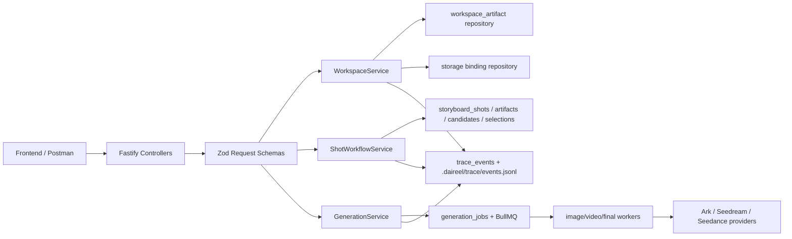

# Backend Development Plan

更新时间：2026-05-30

## 目标

本阶段目标是把 0529 产品与 Prompt API 文档落到后端契约和测试闭环：

- 统一 workspace artifact pipeline 与 per-shot image/video workflow 的公开 API。
- 补齐后端状态机不变量：approve 后 seed shots、image select 后解锁下一镜头、所有图片选定后才解锁视频、所有视频选定后才 final compose。
- 固化 provider 边界：Ark 只负责可确认的中间 artifact 草稿；Seedream / Seedance 只消费后端注入后的确定性上下文。
- 建立 OpenAPI + Postman + Node test 三层测试入口。

## 当前代码基线

| 层 | 当前位置 | 说明 |
|---|---|---|
| Fastify app | `apps/server/src/app.ts` | 注册 system、workspace、material、shot、generation、trace 路由；静态文件读取已有 path traversal 防护。 |
| Workspace pipeline | `apps/server/src/modules/workspace/*` | 当前偏本地目录创建/恢复；0530 目标拆成 logical workspace + storage binding，再承载上传素材、material/brief/storyboard/shotprompt propose/approve。 |
| Shot workflow | `apps/server/src/modules/shot/*` | image prompt、image batch、image select、video script、video batch、video select、retry。 |
| Generation | `apps/server/src/modules/generation/*` | image/video batch job 与 final compose job 创建；worker 负责 provider 调用和 ffmpeg。 |
| Persistence | `apps/server/src/db/schema/schema.sql` | `creative_workspace`、`workspace_artifact`、`storyboard_shots`、prompt artifacts、candidates、selections、jobs、trace events。 |
| Provider/prompt | `packages/ai/src/*`、`packages/shared/src/*` | Prompt workflow、provider adapter、artifact schema、shotprompt compiler。 |
| Tests | `apps/server/src/**/*.test.ts`、`apps/server/test/integration/*.integration.test.ts` | 已有 API/unit/provider smoke 基础，但需要按 0529 新契约补齐断言。 |

## 0529 -> 0530 差距

| 问题 | 当前表现 | 0530 决策 |
|---|---|---|
| workspace 与目录强耦合 | 当前 `/api/workspaces/:id/directory` 像主入口，容易把 workspace id、local path、未来 S3 root 混成一个概念。 | 引入 storage binding：`POST /api/workspaces` 只创建逻辑 workspace；`POST /api/workspaces/:id/storage/bind` 绑定 local 或 S3；目标契约不再暴露 `/directory`。未绑定时 `/api/workspaces/status` 返回 `BIND_STORAGE` 阻断后续阶段。 |
| 路径命名不完全一致 | Prompt 文档倾向 workspace-scoped select，如 `/api/workspaces/:workspaceId/shots/:shotId/image-candidates/select`；代码当前还有 `/api/shots/:shotId/selected-image`。 | 0530 目标契约只保留 workspace-scoped 路径；非 workspace-scoped shot 路径不进入新接口文档。 |
| image-prompt 职责分裂 | Prompt 文档说 propose 可直接产出候选；代码当前是 propose prompt artifact 后再 create batch。 | 0530 采用明确两步：先 propose prompt artifact，再 create batch；round 视图聚合一轮 prompt + batch + candidates 给前端。 |
| select stale 规则冲突 | 0529 Prompt 文档要求 select 不 stale；当前 `selectImage` 会调用 stale rule。 | 修改为 select 只 UPSERT selection；stale 仅发生在 re-propose / re-generate。补回归测试。 |
| scene reference 注入不足 | image prompt 当前依赖 `referenceAssetIds`，未强制注入上一 shot selected image。 | 后端按 shot order 注入：shot 0 用 primary product asset，shot N 用 shot N-1 selected image URL。 |
| video script 解锁条件偏宽 | 当前只要求当前 shot 有 selected image。 | 按文档改为所有 shots 都 image-selected 后才能批量/并行生成视频；单 shot 也要校验 first/last frame 来源。 |
| provider 边界需要护栏 | 已有 provider guard 测试，但成片 prompt 不应再经 Ark text 需要更明确。 | 增加测试：approved shotprompt -> Seedance/final prompt 不调用 Ark text；每个 `shots[].providerPrompt` byte-level 进入最终 prompt。 |
| 候选选择校验不足 | select 入参只校验 schema，业务上还要校验 candidate 状态、shot 归属、ACTIVE 轮次。 | select service 统一校验 candidate 属于当前 shot、当前 ACTIVE round、状态 `SUCCEEDED`。 |
| OpenAPI/Postman 需同步 | 0529 OpenAPI 偏“当前实际路由”，Postman 可跑但缺 0530 新同步点。 | `docs/0530-dev/openapi.yaml` 定义目标契约，Postman 计划按 contract/regression/provider 三层组织。 |

## 0528 r2 -> 当前分支复核差距

本节基于 `docs/0528-agent-arc/spec/r2.md` 重新复核当前后端。r2 中最早列出的 Wave 7 gap 已部分补齐，但仍有几处会阻断真实端到端效果。

| 缺口 | 当前表现 | 0530 目标 |
|---|---|---|
| 素材 `ref` 与 `asset.id` 未统一 | `POST /api/workspaces/materials` 主要返回 `ref/url`；后续 image worker 的 `resolveAssetUrls(ids)` 需要 asset id。测试 helper 仍只能把 `materialAssetIds` 置空。 | 上传素材时创建/关联 `asset` 行，响应返回 `assetId`；material intake / shotprompt / shot_asset_refs 全链路统一可解析引用。 |
| `shot_asset_refs` 没有从 shotprompt seed | `seedShotsFromShotPrompt` 只写 `storyboard_shots`，没有落 `shots[].referenceAssetRefs`。 | approve shotprompt 时同事务写 `storyboard_shots` + `shot_asset_refs`，image prompt 和 worker 从 DB 恢复 shot 参考素材。 |
| prompt 上下文 hydration 过薄 | `proposeImagePrompt` / `proposeVideoScript` 传给 agent 的 `productBrief` 为空，素材 summary 为空。 | service 层统一 hydrate：approved brief、material intake、shotprompt shot、shot_asset_refs、上一轮 prompt、selected image。 |
| Seedance 只接 first frame | video service 会记录 next image id，但 `video.worker` / Seedance provider request 只发送 `first_frame`。 | provider request 支持 `first_frame` + 可选 `last_frame`；中间 shot 必须注入下一 shot selected image，最后一个 shot `lastFrameUrl=null`。 |
| 24h provider URL 未转存 | image/video candidate 入库时 `objectKey` 多为 `null`，直接保存 provider URL。 | worker 生成后立即转存到 workspace `.daireel` 或对象存储；select 返回稳定 URL。 |
| select 缺业务级校验 | select service 主要 UPSERT，未严格校验 candidate 状态、shot 归属、batch/artifact active 关系。 | select 前统一校验 active round、candidate 属于当前 shot、状态 `SUCCEEDED`、batch id 匹配。 |
| batch list / rounds API 不完整 | `GET /api/shots/:shotId/image-batches` 和 video list 仍是 `501`；前端缺“一轮生成”的聚合视图。 | 提供 workspace-scoped batch 与 rounds API，包含 artifact、batch、candidate、selection 和 trace 摘要。 |
| storage 迁移边界不清晰 | 当前所有稳定 URL 默认指向本地 workspace，未来切 S3 时容易影响 workspace 语义和测试变量。 | 所有读写统一经过 `StorageBinding`：一个 workspace 只能有一个 active storage；一个 localPath 或 S3 `bucket+prefix` 只能被一个 workspace 占用。 |
| 真实端到端人工验收未闭环 | r2 acceptance 仍要求手动跑完整真实 provider per-shot flow 并下载 MP4。 | Postman + Playwright/浏览器人工 checklist 记录 workspaceId、finalVideoJobId、下载文件可播放。 |

## 目标后端架构

架构分层约束：

- Controller 只做 route、Zod parse、HTTP error mapping，不写业务分支。
- Service 负责业务不变量和事务，例如 approve seed shots、select UPSERT、all-shots selected gate、idempotency。
- WorkspaceService 负责 storage binding 1:1 不变量：一个 workspace 一个 active storage；一个 localPath 或 S3 `bucket+prefix` 只能绑定一个 workspace；未绑定时只允许 status/bind 类接口继续。
- Repository/DB client 只封装 SQL，不推断下一步业务动作。
- Provider adapter 不读 DB，不知道 workspace 状态，只消费已经组装好的 provider request。
- Worker 可以持久化 provider 24h URL，但不能重新解释 artifact 语义。

## 开发阶段

### Phase 0: 契约冻结与现状保护

输出：

- `docs/0530-dev/openapi.yaml`。
- Postman 测试计划。
- 现有测试基线：`pnpm --filter @aigc-video/server test`。

验收：

- OpenAPI 能被 YAML parser 读取。
- 目标契约不包含旧路径；实现可自行决定迁移方式，但新接口文档不为兼容妥协。
- 对已存在 dirty worktree 不做 reset / clean。

### Phase 1: API 契约对齐

任务：

- 新增 storage binding 契约：
  - `GET /api/workspaces/:workspaceId/storage`
  - `POST /api/workspaces/:workspaceId/storage/bind`
  - local body: `{ kind: "local", localPath }`
  - S3 body: `{ kind: "s3", s3: { bucket, prefix, region?, endpoint? } }`
- `POST /api/workspaces` 支持只创建 logical workspace；如果未绑定 storage，`/api/workspaces/status` 返回 `BIND_STORAGE`，素材上传与 artifact/shot workflow 返回 `STORAGE_NOT_BOUND` 或等价业务错误。
- 新增 workspace-scoped shot workflow 路径：
  - `POST /api/workspaces/:workspaceId/shots/:shotId/image-batches`
  - `GET /api/workspaces/:workspaceId/shots/:shotId/image-batches/:batchId`
  - `POST /api/workspaces/:workspaceId/shots/:shotId/image-candidates/select`
  - `POST /api/workspaces/:workspaceId/shots/:shotId/video-batches`
  - `GET /api/workspaces/:workspaceId/shots/:shotId/video-batches/:batchId`
  - `POST /api/workspaces/:workspaceId/shots/:shotId/video-candidates/select`
  - `GET /api/workspaces/:workspaceId/shots/:shotId/image-rounds`
  - `GET /api/workspaces/:workspaceId/shots/:shotId/video-rounds`
- `POST /api/workspaces/materials` 响应补稳定 `assetId`，并保证 asset row 能被 `resolveAssetUrls(assetId)` 找回。
- 请求字段统一使用 `userDirection`，不再保留 `userHint`。

验收：

- storage binding 唯一性测试覆盖：同 workspace 不能绑定不同 storage，同 localPath/S3 `bucket+prefix` 不能绑定多个 workspace。
- 未绑定 storage 的 workspace 只能进入 `BIND_STORAGE` 状态，不能上传素材或推进 artifact/shot workflow。
- OpenAPI 不再列出非 workspace-scoped shot 路径或 `/directory`。
- OpenAPI 与 Zod request schema 对齐。
- Postman contract smoke 能跑通 system + workspace + artifact + shot list。

### Phase 2: Workflow 不变量修复

任务：

- approve shotprompt 同事务 seed `storyboard_shots` + `shot_asset_refs`，并保留原 `referenceAssetRefs` 的顺序和 role。
- `selectImage` / `selectVideo` 改成纯同步点，不触发 stale。
- image propose 自动注入 `image_ref`：
  - shot 0: `materialIntake.primaryProductRef` 的稳定素材 URL。
  - shot N: `selected_shot_images[shot N-1].url`。
- video propose 校验 workspace 内所有 shot 都 image-selected，再注入 first/last frame。
- candidate select 校验 ACTIVE round、candidate 归属、状态 `SUCCEEDED`。
- final compose 保持拉模式：每次读取当下 `selected_shot_videos`。

验收：

- `shot.stale.unit.test.ts` 覆盖 select 不 stale、re-propose stale。
- `shot.workflow.api.test.ts` 覆盖 image/video select 幂等、非法 candidate、失败 candidate。
- `final-compose-contract.integration.test.ts` 覆盖重新 select 后 final compose 使用最新选择。

### Phase 3: Provider boundary hardening

任务：

- `approved shotprompt -> Seedance prompt` 只走 deterministic compiler。
- 成片任务必须使用 `job.payload.shotprompt`；旧 script 载荷不进入 0530 目标契约。
- Seedance prompt 的“逐镜头时间线”包含每个 `shots[].providerPrompt` 原文。
- video export 阶段不调用 Ark text provider，只调用 Seedance video provider / deterministic compiler。
- Seedance video provider 支持 `{role:"last_frame"}`，中间 shot 的 request 必须包含 first/last 两张图，最后一个 shot 只包含 first frame。
- image/video worker 负责把 provider 24h URL 转存为 workspace 稳定 URL，并把 `objectKey` / `localUrl` 写入 candidate。
- 所有 provider-facing prompt 使用中文组装。

验收：

- provider boundary 测试断言 Ark text provider 在 video export 阶段调用次数为 0。
- unit test 断言最终 prompt 包含每个 `shots[].providerPrompt`。
- real provider smoke 前执行 `pnpm db:clear -- --yes`，并使用新的测试 workspace。

### Phase 4: 后端测试闭环

任务：

- Unit/API tests:
  - Zod schema parse / error code。
  - workspace storage 404、未绑定、重复绑定。
  - material upload size/type/path。
  - approve seed shots。
  - idempotency key dedupe。
  - selected image/video UPSERT。
- Integration tests:
  - mock full pipeline。
  - image provider smoke。
  - video provider expensive smoke。
  - final compose with ffmpeg。
- Postman tests:
  - contract smoke。
  - regression negative cases。
  - provider runbook。

验收：

- `pnpm --filter @aigc-video/server test` 通过。
- provider smoke 可通过环境变量显式开启，默认不跑真实模型。
- Postman Runner 能按顺序自动回填 `workspaceId`、`shotId`、candidate/batch/job ids。

## 需要优先落地的代码任务

| 优先级 | 任务 | 代码入口 | 测试入口 |
|---|---|---|---|
| P0 | storage binding 抽象与 1:1 唯一性 | `workspace.service.ts`、DB schema/repository、storage helper | `workspace.api.test.ts`、storage binding unit tests |
| P0 | 上传素材创建/暴露 `assetId`，打通 `ref -> asset.id -> URL/dataURL` | `workspace.service.ts`、`material.repository.ts`、`asset-url-resolver.ts` | `workspace.api.test.ts`、`asset-url-resolver.unit.test.ts` |
| P0 | approve shotprompt 写 `shot_asset_refs` | `workspace.service.ts` / DB helper | `workspace.api.test.ts`、`shot.workflow.api.test.ts` |
| P0 | prompt 上下文 hydration | `shot.service.ts` | image/video prompt agent tests、API trace assertions |
| P0 | Seedance last_frame 支持 | `video.worker.ts`、`seedance-video.provider.ts` | `video.worker.unit.test.ts`、provider request contract test |
| P0 | provider URL 稳定转存 | `image.worker.ts`、`video.worker.ts`、storage helper | worker unit tests、select URL assertions |
| P0 | 修正 select 不 stale | `apps/server/src/modules/shot/shot.service.ts` | `shot.stale.unit.test.ts`、`shot.workflow.api.test.ts` |
| P0 | candidate select 业务校验 | `shot.service.ts` + DB helper | `shot.workflow.api.test.ts` |
| P0 | all-shots image-selected gate | `proposeVideoScript` | `shot.workflow.api.test.ts` |
| P0 | deterministic Seedance prompt 护栏 | `packages/shared/src/shotprompt/compiler.ts` / generation worker | provider boundary tests |
| P1 | workspace-scoped select aliases | `shot.controller.ts` | API tests + Postman |
| P1 | image/video rounds 聚合查询 | `shot.service.ts` | API tests |
| P1 | OpenAPI 与 Postman collection 生成/同步 | docs + optional script | YAML validation + collection smoke |
| P2 | KOL 发布/点击量接口预留 | 新 `campaign`/`channel` module | Contract tests |

## 完成定义

- 后端公开 API 有 `openapi.yaml` 对应。
- 每个新增或调整 route 有成功、关键失败、幂等/状态机测试。
- Postman 测试计划覆盖本地 mock、真实 provider smoke、expensive video flow 三种运行模式。
- provider boundary 能回答：“最终 Seedance prompt 的每一句来自哪个 artifact 字段。”
- 用户确认过的 artifact 在下游不会被 LLM 静默改写。
