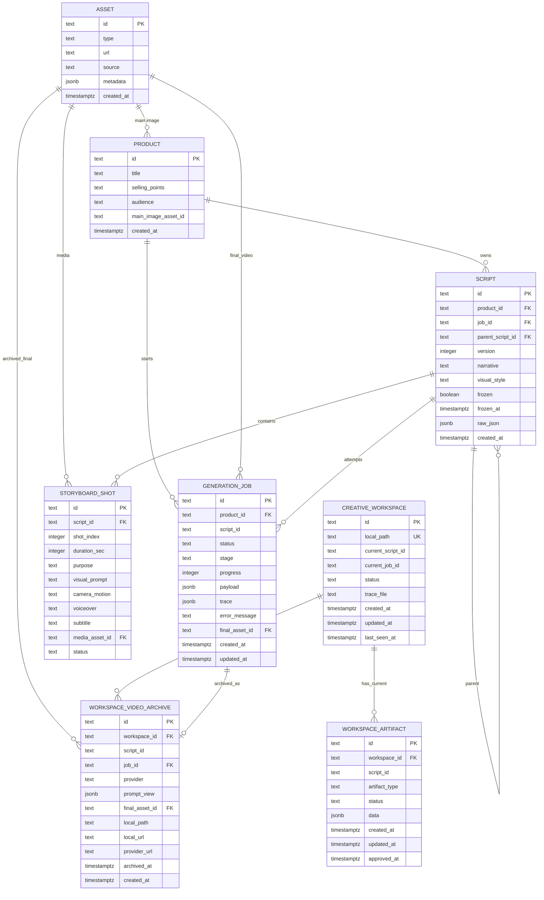

# Current Data Model

Postgres is the required business fact source for the current V0 + V1 implementation. The runtime schema is initialized from `apps/server/src/db/schema/`.

Local work directories may contain `.daireel/workspace.json`, traces, materials, or videos, but those local files are recovery and artifact storage. The authoritative workspace, artifact, job, and video archive facts live in Postgres.

## Tables

```text
Product
  id
  title
  sellingPoints
  audience
  mainImageAssetId          # optional FK-like reference to Asset
  createdAt

Asset
  id
  type                      # product_image | generated_clip | final_video | audio | subtitle
  url
  source                    # upload | seedance | tts | mock | local archive
  metadata
  createdAt

GenerationJob
  id
  productId                 # FK to Product
  scriptId                  # optional FK-like reference to Script or workspace currentScriptId
  status                    # queued | running | completed | failed
  stage                     # queued | script_generating | media_generating | completed | failed
  progress
  payload
  trace
  errorMessage
  finalAssetId              # optional FK to Asset
  createdAt
  updatedAt

CreativeWorkspace
  id
  localPath                 # unique local project directory path
  currentScriptId           # preallocated current creative-line/script id
  currentJobId              # optional current async video job id
  status                    # draft -> materials_ready -> ... -> video_ready / failed
  traceFile                 # local trace path, currently .daireel/trace/events.jsonl
  createdAt
  updatedAt
  lastSeenAt

WorkspaceArtifact
  id
  workspaceId               # FK to CreativeWorkspace
  scriptId                  # creative line id associated with this artifact
  artifactType              # material | brief | storyboard | shotprompt | feedback_route
  status                    # proposed | approved | stale | failed
  data                      # JSON artifact payload
  createdAt
  updatedAt
  approvedAt
  unique(workspaceId, artifactType)

WorkspaceVideoArchive
  id
  workspaceId               # FK to CreativeWorkspace
  scriptId                  # creative line id
  jobId                     # unique FK to GenerationJob
  provider                  # seedance
  promptView                # JSON prompt/run view used for final video generation
  finalAssetId              # FK to Asset
  localPath                 # local archived file path
  localUrl                  # app-served local video URL
  providerUrl               # original provider-returned video URL
  archivedAt
  createdAt

Script
  id
  productId                 # FK to Product
  jobId                     # optional FK to GenerationJob
  parentScriptId            # optional FK to Script
  version
  narrative
  visualStyle
  frozen
  frozenAt
  rawJson                   # V0 CreativeBlueprint, trace, and improvement hints
  createdAt

StoryboardShot
  id
  scriptId                  # FK to Script
  index
  durationSec
  purpose
  visualPrompt
  cameraMotion
  voiceover
  subtitle
  mediaAssetId              # optional FK to Asset
  status
```

## Relationships

```text
Product.mainImageAssetId -> Asset.id
Product 1 -> n Script
Product 1 -> n GenerationJob

Script.jobId -> GenerationJob.id
Script.parentScriptId -> Script.id
Script 1 -> n StoryboardShot
Script 1 -> n GenerationJob attempts via GenerationJob.scriptId
StoryboardShot.mediaAssetId -> Asset.id

GenerationJob.finalAssetId -> Asset.id
GenerationJob.scriptId -> Script.id or CreativeWorkspace.currentScriptId

CreativeWorkspace 1 -> n WorkspaceArtifact
CreativeWorkspace.currentJobId -> GenerationJob.id
CreativeWorkspace.currentScriptId -> WorkspaceArtifact.scriptId

WorkspaceArtifact.workspaceId -> CreativeWorkspace.id
WorkspaceArtifact.scriptId -> CreativeWorkspace.currentScriptId

WorkspaceVideoArchive.workspaceId -> CreativeWorkspace.id
WorkspaceVideoArchive.jobId -> GenerationJob.id
WorkspaceVideoArchive.finalAssetId -> Asset.id
WorkspaceVideoArchive.scriptId -> CreativeWorkspace.currentScriptId
```

Notes:

- `GenerationJob.scriptId` is a plain text column. In V0 it refers to `script.id`; in V1 workspace video generation it can refer to a workspace `currentScriptId`.
- `CreativeWorkspace.currentJobId` is currently stored as text, not a SQL FK, but it is intended to point at the active/recoverable `GenerationJob`.
- `Product.mainImageAssetId` is modeled as text in SQL and used as an asset reference by repository code.
- `WorkspaceArtifact` keeps one current artifact per `(workspaceId, artifactType)`. V1 does not maintain artifact version history in this table.

## Mermaid ERD



## V0 Invariants

```text
A 草稿蓝图 is represented by a non-frozen Script.
A Script becomes frozen when a GenerationJob is created from its scriptId.
Editing a frozen Script creates a new Script with parentScriptId set.
One frozen Script can be used by multiple GenerationJob attempts.
StoryboardShot is a script beat, not an independently rendered clip.
```

## V1 Workspace Invariants

```text
A CreativeWorkspace is recognized by Postgres localPath plus its local .daireel/workspace.json manifest.
CreativeWorkspace.currentScriptId is the current creative line id for V1.
V1 keeps one current WorkspaceArtifact per artifactType; feedback creates a new proposed current artifact, not history rows.
WorkspaceArtifact.status gates user approval and downstream steps.
GenerationJob.currentJobId is the async video recovery anchor.
WorkspaceVideoArchive preserves generated video outputs by jobId so old videos are not overwritten by feedback or regeneration.
Local trace files record provider/workflow evidence, while Postgres stores artifact/job/archive facts.
```
