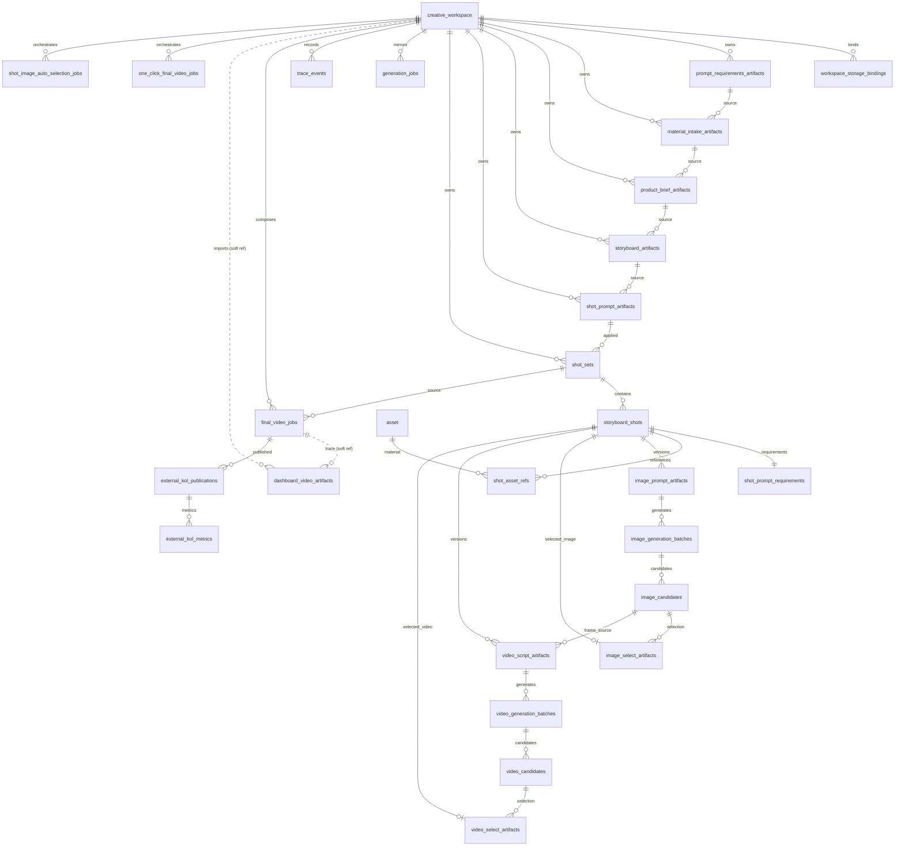

# ERD

Status: Accepted
Owner: Project team
Last Updated: 2026-06-08
Applies To: PostgreSQL schema and queue/storage fact boundaries
Depends On: `apps/server/src/db/schema/schema.sql`, `architecture/data_model.md`
Blocks: Schema or persistence changes without matching docs/tests
Decision State: Accepted

## 1. Executive Summary

PostgreSQL 16 is the only business fact source. Redis is used for BullMQ queues only. Workspace files under `.daireel/`, S3-compatible storage, and dashboard asset copies are media/storage surfaces; they do not replace DB artifact, candidate, selection, trace, or job facts.

## 2. Current Reality

The authoritative DDL is `apps/server/src/db/schema/schema.sql`. The active schema contains legacy `product`, `asset`, `script`, and `workspace_artifact` tables, but V3 creative flow uses module-owned artifact tables and shot-set scoped execution tables.

## 3. Target State

## 4. Contracts / Interfaces

### Core Tables

| Table | Purpose | Key constraints |
|---|---|---|
| `creative_workspace` | Workspace business state | `id` primary key; `local_path` nullable. |
| `workspace_storage_bindings` | Active LOCAL/S3 storage target | One active binding per workspace; LOCAL requires normalized path; S3 requires bucket/prefix. |
| `prompt_requirements_artifacts` | 创作要求 artifact | Partial unique index for current approved. |
| `material_intake_artifacts` | 素材解读 artifact | Partial unique index for current approved. |
| `product_brief_artifacts` | 商品卖点 artifact | Partial unique index for current approved. |
| `storyboard_artifacts` | 分镜脚本 artifact | Partial unique index for current approved. |
| `shot_prompt_artifacts` | 分镜生成要求 artifact | Partial unique index for current approved. |
| `shot_sets` | 分镜链路实例 | One active shot set per workspace. |
| `storyboard_shots` | Shot execution anchor | Unique `(shot_set_id, order_index)` for applied sets. |
| `shot_prompt_requirements` | Per-shot `shotImage`/`shotVideo` | One row per shot. |
| `shot_asset_refs` | Editable material refs | Unique `(shot_id, asset_id, role)`. |
| `image_prompt_artifacts` | Per-shot image prompt versions | Unique `(shot_id, version)`. |
| `image_generation_batches` / `image_candidates` | Image generation facts | Batch/candidate status and provider request/response; service layer treats `PENDING/RUNNING` as one active image batch per shot. No-feedback reroll creates a new terminal-round successor batch. |
| `image_select_artifacts` | Current 分镜图选择 | `shot_id` unique. |
| `video_script_artifacts` | Per-shot video script versions | Unique `(shot_id, version)`. |
| `video_generation_batches` / `video_candidates` | Video generation facts | Supports candidate `PERSISTING`; service layer treats `PENDING/RUNNING` as one active video batch per shot. `PARTIAL` batches may still supply selectable succeeded candidates, and no-feedback reroll creates a new terminal-round successor batch. |
| `video_select_artifacts` | Current 分镜视频选择 | `shot_id` unique. |
| `generation_jobs` | BullMQ business mirror | Related batch/candidate/final job id. |
| `trace_events` | Agent/provider/job/user audit | Indexed by workspace and shot. |
| `final_video_jobs` | Final compose jobs | Idempotency key unique; points to `shot_set_id`. |
| `dashboard_video_artifacts` | Imported dashboard videos (decoupled registry) | Non-null four-factor `creative_factors` + LOCAL/S3 storage locator columns. `workspace_id`/`final_video_job_id` are **soft text refs** (no FK, no cascade); partial unique index on `final_video_job_id`; survives workspace deletion; S3 copies live in the dedicated `DASHBOARD_S3_BUCKET`. |
| `one_click_final_video_jobs` | One-click orchestrator | One active job per workspace while `PENDING/RUNNING/WAITING`. |
| `shot_image_auto_selection_jobs` | Auto image selection orchestrator | One active job per workspace while `PENDING/RUNNING/WAITING`; mutually exclusive with ordinary image batches in the active shot set. |
| `external_kol_publications` | 发布记录 | One KOL/channel placement of a final video (`job_id`, `platform`, `account_name`, `published_at`); `job_id` validated to the workspace. |
| `external_kol_metrics` | 投放数据 | Append-only cumulative metric snapshots (`impressions/clicks/conversions/spend_cents/gmv_cents`); indexed by publication and `created_at`. |

### Enums

- `shot_status`: per-shot workflow state.
- `artifact_status`: per-shot prompt artifact state.
- `batch_status`: image/video batch state.
- `candidate_status`: includes `PERSISTING` for provider-ready video before stable storage.
- `job_status`: generation job mirror state.
- `final_video_status`: final compose state.
- `workspace_storage_kind`: `LOCAL` or `S3`.
- `workspace_storage_status`: `ACTIVE` or `ARCHIVED`.

## 5. Implementation Slices

- Keep DDL and TypeScript DB row mappers aligned.
- Use DB transactions when switching current approved artifacts or applying shot sets.
- Keep object storage paths relative to workspace adapter roots.

## 6. Acceptance Tests

- Server API/unit tests that insert and query each table family.
- `git diff --check -- docs/core`.
- Contract check for public API surface.

## 7. Open Decisions

- Migrations are currently schema-file driven for local/dev. A production migration runner would need ADR coverage.

## 8. Related Docs

- `architecture/data_model.md`
- `architecture/backend.md`
