# erd — V3 数据库与缓存架构

> 数据层目标文档。配套 [`arc_v3.md`](./arc_v3.md) 与 [`interface.md`](./interface.md)。
>
> 引擎：**PostgreSQL 16** 是唯一业务事实源。访问层维持原生 `pg` Pool + 手写参数化 SQL，不引入 ORM。DDL 权威来源仍为 `apps/server/src/db/schema/schema.sql`，迁移期直接更新该文件。Redis 仅服务 BullMQ 队列，不作为业务缓存。

---

## 1. 设计原则

- **模块自有 artifact 表**：`prompt_requirements_artifacts`、`material_intake_artifacts`、`product_brief_artifacts`、`storyboard_artifacts`、`shot_prompt_artifacts` 分别保存本模块产物，不再把主链路写入通用 `workspace_artifact`。
- **物理追加，业务覆盖**：每次 propose/approve 都插入新行；业务上的“当前版本”由 `status='approved' and is_current=true` 指针表达。新 approved 会取消旧 approved 的 current 标记，但不物理删除旧行。
- **无单会话版本追踪/回滚 UI**：历史行只用于审计、debug 和追溯，不作为产品级回滚功能。
- **主体 prompt 与契约 prompt 分离**：artifact 表保存 `prompt_assembly` 元信息和 prompt preview；完整 assembled prompt 写入 trace，不在业务表冗余大文本。
- **主体 prompt 可业务迭代，契约 prompt 工程锁定**：业务/剧本同学修改 `packages/ai/src/prompts/modules/<module>/subject.md`；`contract.md` 只随输入输出 schema 或 provider 硬约束变化。两者的 hash 都写入 `prompt_assembly`。
- **只有 approved/current 进入下游**：proposed artifact 供用户审核，不自动驱动后续模块。
- **上游变更只提示，不级联重置**：下游已生成内容保留可用；通过 `source_fingerprint` 对比暴露 `upstreamChanged`。
- **shot set 是分镜链路实例**：approved shot prompt 只有在显式 apply 后才创建新的 active `shot_sets`。旧 shot set 归档但候选、选择、trace 继续作为数据库事实保留。
- **当前工作流只读 active shot set**：`shot-workflow-status`、next shot、首尾帧、选图/选视频完成度和视频生成前置检查都限定在当前 active `shot_sets`；archived rows 不提供商家工作台读取或操作入口。
- **选择是 current 指针**：每个 shot 至多一个 selected image 和 selected video，写入 `image_select_artifacts` / `video_select_artifacts`。重复选择用 UPSERT 覆盖，不使未选候选 stale。
- **自动编排只保存编排状态**：`one_click_final_video_jobs` 与 `shot_image_auto_selection_jobs` 记录跨阶段进度和错误，不替代 artifact、candidate 或 selection 事实表。
- **工作区身份持久于磁盘**：`.daireel/workspace.json` 保存 `workspaceId` 作为持久身份；DB `creative_workspace` 行是可被 `reset:dev` 清空的业务状态。DB 行缺失时 `POST /api/workspaces/init` 复用磁盘 manifest 的原始 `workspaceId` 重新登记（不新建），`GET /api/workspaces` 经 `WORKSPACE_DISCOVERY_ROOTS` 扫描出磁盘有 manifest 但 DB 无行的草稿（`discovered`）。详见 `arc_v3.md` §14。
- **对象存储是 workspace storage binding，不是业务事实源**：`workspace_storage_bindings` 记录 LOCAL 或 S3-compatible 位置；S3 object key 固定在 `workspaces/{workspaceId}/{relativePath}` 下。DB 仍保存 artifact、候选、选择、trace 等业务事实，前端只访问 server 代理 URL。

---

## 2. ER 图

```mermaid
erDiagram
    product ||--o{ asset : "has material"
    product ||--o{ script : "legacy script versions"

    creative_workspace ||--o{ workspace_storage_bindings : "storage bindings"
    creative_workspace ||--o{ prompt_requirements_artifacts : "creative requirements"
    creative_workspace ||--o{ material_intake_artifacts : "material intake"
    creative_workspace ||--o{ product_brief_artifacts : "brief"
    creative_workspace ||--o{ storyboard_artifacts : "storyboard"
    creative_workspace ||--o{ shot_prompt_artifacts : "shot prompt"
    creative_workspace ||--o{ shot_sets : "shot chain instances"
    creative_workspace ||--o{ image_generation_batches : "image jobs"
    creative_workspace ||--o{ video_generation_batches : "video jobs"
    creative_workspace ||--o{ final_video_jobs : "compose jobs"
    creative_workspace ||--o{ dashboard_video_artifacts : "dashboard videos"
    creative_workspace ||--o{ one_click_final_video_jobs : "one-click jobs"
    creative_workspace ||--o{ shot_image_auto_selection_jobs : "shot image auto-selection jobs"
    creative_workspace ||--o{ generation_jobs : "queue jobs"
    creative_workspace ||--o{ trace_events : "trace"

    prompt_requirements_artifacts ||--o{ material_intake_artifacts : "source"
    material_intake_artifacts ||--o{ product_brief_artifacts : "source"
    product_brief_artifacts ||--o{ storyboard_artifacts : "source"
    storyboard_artifacts ||--o{ shot_prompt_artifacts : "source"
    shot_prompt_artifacts ||--o{ shot_sets : "applied as"

    shot_sets ||--o{ storyboard_shots : "contains"
    storyboard_shots ||--o{ shot_prompt_requirements : "1:1"
    storyboard_shots ||--o{ shot_asset_refs : "references"
    asset ||--o{ shot_asset_refs : "referenced by"

    storyboard_shots ||--o{ image_prompt_artifacts : "versions"
    image_prompt_artifacts ||--o{ image_generation_batches : "generates"
    image_generation_batches ||--o{ image_candidates : "candidates"
    storyboard_shots ||--o| image_select_artifacts : "current selected image"
    image_candidates ||--o{ image_select_artifacts : "selected candidate"

    image_candidates ||--o{ video_script_artifacts : "first/last frame source"
    storyboard_shots ||--o{ video_script_artifacts : "versions"
    video_script_artifacts ||--o{ video_generation_batches : "generates"
    video_generation_batches ||--o{ video_candidates : "candidates"
    storyboard_shots ||--o| video_select_artifacts : "current selected video"
    video_candidates ||--o{ video_select_artifacts : "selected candidate"

    shot_sets ||--o{ final_video_jobs : "compose source"
    shot_sets ||--o{ shot_image_auto_selection_jobs : "image selection scope"
    one_click_final_video_jobs }o--o| material_intake_artifacts : "approved start"
    one_click_final_video_jobs }o--o| final_video_jobs : "compose result"
    final_video_jobs ||--o{ dashboard_video_artifacts : "imported to dashboard"
    final_video_jobs ||--o{ campaign_publications : "published as"
    campaign_publications ||--o{ campaign_publication_metrics : "metrics"

    generation_jobs }o--o| storyboard_shots : "shot_id"
    trace_events }o--o| storyboard_shots : "shot_id"

    creative_workspace {
        text id PK
        text local_path
        text current_script_id
        text current_job_id
        text status
        text trace_file
        timestamptz created_at
        timestamptz updated_at
        timestamptz last_seen_at
    }

    workspace_storage_bindings {
        text id PK
        text workspace_id FK
        text kind "LOCAL/S3"
        text status "ACTIVE/ARCHIVED"
        text local_path
        text local_path_normalized
        text s3_bucket
        text s3_prefix
        text s3_region
        text s3_endpoint
        jsonb metadata
        timestamptz created_at
        timestamptz updated_at
    }

    prompt_requirements_artifacts {
        text id PK
        text workspace_id FK
        text status "proposed/approved/archived/failed"
        boolean is_current
        jsonb data "creative requirements by slot"
        jsonb source_fingerprint
        jsonb prompt_assembly
        timestamptz created_at
        timestamptz updated_at
        timestamptz approved_at
    }

    material_intake_artifacts {
        text id PK
        text workspace_id FK
        text status
        boolean is_current
        jsonb data "material summary and selected refs"
        jsonb source_fingerprint
        jsonb prompt_assembly
        timestamptz created_at
        timestamptz updated_at
        timestamptz approved_at
    }

    product_brief_artifacts {
        text id PK
        text workspace_id FK
        text status
        boolean is_current
        jsonb data "product brief"
        jsonb source_fingerprint
        jsonb prompt_assembly
        timestamptz created_at
        timestamptz updated_at
        timestamptz approved_at
    }

    storyboard_artifacts {
        text id PK
        text workspace_id FK
        text status
        boolean is_current
        jsonb data "storyboard beats"
        jsonb source_fingerprint
        jsonb prompt_assembly
        timestamptz created_at
        timestamptz updated_at
        timestamptz approved_at
    }

    shot_prompt_artifacts {
        text id PK
        text workspace_id FK
        text status
        boolean is_current
        jsonb data "shots with shotImage/shotVideo dicts"
        jsonb source_fingerprint
        jsonb prompt_assembly
        timestamptz created_at
        timestamptz updated_at
        timestamptz approved_at
    }

    shot_sets {
        text id PK
        text workspace_id FK
        text shot_prompt_artifact_id FK
        text status "active/archived"
        jsonb source_fingerprint
        timestamptz created_at
        timestamptz archived_at
    }

    storyboard_shots {
        text id PK
        text workspace_id FK
        text shot_set_id FK
        int order_index
        text title
        text objective
        int default_duration_sec
        text status
        text next_action
        text active_image_prompt_artifact_id
        text selected_image_id
        text active_video_script_artifact_id
        text selected_video_id
        text last_error
        timestamptz created_at
        timestamptz updated_at
    }

    shot_prompt_requirements {
        text id PK
        text shot_id FK
        jsonb shot_image "per-shot image requirement dict"
        jsonb shot_video "per-shot video requirement dict"
        text source_shot_prompt_artifact_id FK
        timestamptz created_at
        timestamptz updated_at
    }

    image_prompt_artifacts {
        text id PK
        text shot_id FK
        int version
        text status "DRAFT/ACTIVE/APPROVED/STALE/ARCHIVED"
        text prompt_text
        text negative_prompt
        text[] reference_asset_ids
        jsonb prompt_json
        jsonb source_fingerprint
        jsonb prompt_assembly
        text created_by
        text agent_name
        text prompt_template_version
        text base_artifact_id FK
        timestamptz created_at
    }

    image_generation_batches {
        text id PK
        text workspace_id FK
        text shot_id FK
        text image_prompt_artifact_id FK
        text status
        int requested_count
        int succeeded_count
        int failed_count
        text provider
        text aspect_ratio
        jsonb provider_request
        text error_message
        text idempotency_key
        timestamptz created_at
        timestamptz updated_at
    }

    image_candidates {
        text id PK
        text batch_id FK
        text workspace_id FK
        text shot_id FK
        text image_url
        text object_key
        int width
        int height
        text seed
        text provider
        jsonb provider_response
        text status
        text error_message
        timestamptz created_at
    }

    image_select_artifacts {
        text id PK
        text shot_id FK "UNIQUE"
        text image_candidate_id FK
        text image_generation_batch_id FK
        text selected_by
        timestamptz selected_at
    }

    video_script_artifacts {
        text id PK
        text shot_id FK
        int version
        text status
        int duration_sec
        jsonb script_json
        text provider_prompt
        text based_on_image_candidate_id FK
        text based_on_prev_image_candidate_id FK
        text based_on_next_image_candidate_id FK
        jsonb source_fingerprint
        jsonb prompt_assembly
        text created_by
        text agent_name
        text prompt_template_version
        text base_artifact_id FK
        timestamptz created_at
    }

    video_generation_batches {
        text id PK
        text workspace_id FK
        text shot_id FK
        text video_script_artifact_id FK
        text status
        int requested_count
        int succeeded_count
        int failed_count
        text provider
        text aspect_ratio
        jsonb provider_request
        text error_message
        text idempotency_key
        timestamptz created_at
        timestamptz updated_at
    }

    video_candidates {
        text id PK
        text batch_id FK
        text workspace_id FK
        text shot_id FK
        text video_url
        text object_key
        text thumbnail_url
        int duration_sec
        int width
        int height
        text provider
        jsonb provider_response
        text status
        text error_message
        timestamptz created_at
    }

    video_select_artifacts {
        text id PK
        text shot_id FK "UNIQUE"
        text video_candidate_id FK
        text video_generation_batch_id FK
        text selected_by
        timestamptz selected_at
    }

    final_video_jobs {
        text id PK
        text workspace_id FK
        text shot_set_id FK
        text status
        text output_aspect_ratio
        jsonb source_video_candidate_ids
        jsonb source_video_script_artifact_ids
        text local_path "storage object path in current adapter"
        text local_url "stable API proxy URL"
        jsonb compiled_manifest
        text error_message
        timestamptz created_at
        timestamptz updated_at
    }

    dashboard_video_artifacts {
        text id PK
        text workspace_id FK
        text final_video_job_id FK
        text name
        text local_url
        int duration_sec
        int width
        int height
        jsonb creative_tags
        jsonb creative_factors
        jsonb metadata
        timestamptz imported_at
        timestamptz created_at
        timestamptz updated_at
    }

    one_click_final_video_jobs {
        text id PK
        text workspace_id FK
        text status "PENDING/RUNNING/WAITING/SUCCEEDED/FAILED/CANCELLED"
        text current_stage
        jsonb stage_state
        text material_intake_artifact_id FK
        text product_brief_artifact_id FK
        text storyboard_artifact_id FK
        text shot_prompt_artifact_id FK
        text shot_set_id FK
        text final_video_job_id FK
        text auto_selection_strategy
        text output_aspect_ratio
        text error_code
        text error_message
        text idempotency_key
        timestamptz created_at
        timestamptz updated_at
    }

    shot_image_auto_selection_jobs {
        text id PK
        text workspace_id FK
        text status "PENDING/RUNNING/WAITING/SUCCEEDED/FAILED/CANCELLED"
        text current_stage
        jsonb stage_state
        text shot_set_id FK
        int candidate_count
        text auto_selection_strategy
        text error_code
        text error_message
        text idempotency_key
        timestamptz created_at
        timestamptz updated_at
        timestamptz started_at
        timestamptz completed_at
    }
```



---

## 3. 模块 artifact 表

五个工作区级模块表采用同一套结构：

| 字段 | 语义 |
|---|---|
| `id` | artifact id。 |
| `workspace_id` | 所属工作区。 |
| `status` | `proposed`、`approved`、`archived`、`failed`。 |
| `is_current` | 当前业务指针。每个 workspace + module 最多一条 `approved/current`。 |
| `data` | 模块输出 JSON。只存结构化产物，不存完整 final prompt。 |
| `source_fingerprint` | 本产物生成时读取的上游 current artifact id/hash。用于检测上游变更。 |
| `prompt_assembly` | workspace module 的 prompt 组装元数据：`moduleId`、`assemblerVersion`、`subjectTemplateId`、`contractTemplateId`、`subjectHash`、`contractHash`、`requirementArtifactId`、`preview`、provider/model 等。 |
| `approved_at` | 用户 approve 时间。 |

推荐约束：

```sql
create unique index if not exists prompt_requirements_current_approved_idx
  on prompt_requirements_artifacts (workspace_id)
  where status = 'approved' and is_current = true;
```

其余模块表使用同样的 partial unique index。approve 流程在事务内：

1. 锁定 workspace 对应模块 current 行。
2. 将旧 current 行 `is_current=false`。
3. 插入或更新本次 approved artifact，置 `status='approved', is_current=true, approved_at=now()`。

---

## 4. Prompt 要求与装配元数据

### 4.1 Prompt requirements

`prompt_requirements_artifacts.data` 保存用户可编辑的结构化创作要求。推荐形态：

```json
{
  "image": {
    "style": "realistic ecommerce product photography",
    "composition": "close-up hero product, clean background",
    "avoid": ["text overlay", "extra product variants"]
  },
  "script": {
    "tone": "confident and concise",
    "sellingPoints": ["portable", "premium texture"]
  },
  "storyboard": {
    "rhythm": "fast opening, clear product reveal"
  },
  "shotImage": {
    "global": "each shot must preserve the same product identity"
  },
  "shotVideo": {
    "global": "smooth motion, avoid abrupt camera jumps"
  },
  "creativeFactors": {
    "productType": "offline-experience-service",
    "audience": "child",
    "strategy": "scenario-demo",
    "visualStyle": "authentic"
  },
  "creativeRequirementTemplate": {
    "source": "setup-template",
    "templateId": "offline-child-travel",
    "templateNameSnapshot": "亲子旅游·家长向",
    "templateVersion": "p0-2026-06",
    "status": "applied"
  }
}
```

用户不直接编辑 provider system prompt。后端 assembler 将当前 requirements 注入主体 prompt。`factorGuidance` / `scriptInfluence` 保存三个看板主标签展开后的细分字段；`visualStyle` 作为默认化视觉风格控制汇入部分编译字段；`compiledRequirementSourceMap` 保存 7 项字段的来源解释，供首屏和审计使用。

### 4.2 Prompt assembly

workspace module artifact 表的 `prompt_assembly` 保存 subject/contract 模板元数据：

```json
{
  "moduleId": "shotprompt",
  "subjectTemplateId": "shotprompt/subject.md",
  "contractTemplateId": "shotprompt/contract.md",
  "subjectHash": "sha256-of-subject",
  "contractHash": "sha256-of-contract",
  "assemblerVersion": "2026-05-31",
  "requirementArtifactId": "req_...",
  "provider": "ark",
  "model": "doubao-seed-1-6",
  "preview": "short prompt preview for debugging"
}
```

逐 shot `image_prompt_artifacts` / `video_script_artifacts` 不走 subject/contract 二次 agent。它们由后端 deterministic assembler 生成 provider-facing prompt，`prompt_assembly` 形态为：

```json
{
  "moduleId": "image-prompt",
  "assemblerVersion": "shot-image-assembler-version",
  "source": "server-deterministic-assembler",
  "mode": "propose"
}
```

反馈重生成时 `mode="user-feedback-regenerate"`，`moduleId` 可为 `image-prompt` 或 `video-script`。`subjectTemplateId` 指向 workspace module 的业务主体 prompt。剧本同学如果要改主剧本 / shotprompt 的生成策略，应修改 `packages/ai/src/prompts/modules/shotprompt/subject.md`；如果要改单个 shot 的图像或视频执行 prompt，应修改 server deterministic assembler。`contractTemplateId` 指向工程契约 prompt，不作为日常业务自定义入口。

完整 assembled prompt / provider prompt 摘要进入 `trace_events.metadata`；LOCAL workspace 额外镜像到 `.daireel/trace/events.jsonl`，便于本地调试。S3 workspace 不写 JSONL mirror。

---

## 5. Shot set 与分镜要求

`shot_prompt_artifacts.data.shots[]` 是 approved shot prompt 的结构化输出，每个 shot 至少包含：

```json
{
  "id": "shot-1",
  "title": "Opening product reveal",
  "startSec": 0,
  "endSec": 4,
  "visualPrompt": "...",
  "shotImage": {
    "subject": "product in hand",
    "composition": "centered close-up",
    "lighting": "soft daylight"
  },
  "shotVideo": {
    "motion": "slow push-in",
    "continuity": "keep the same product angle",
    "durationSec": 4
  }
}
```

显式 apply 后：

- 创建新的 `shot_sets(status='active')`，引用当前 approved `shot_prompt_artifacts.id`。
- 将旧 active shot set 改为 `archived`。
- 按 shot prompt 创建新 `storyboard_shots`。
- 为每个 shot 创建 `shot_prompt_requirements`，把 `shotImage` / `shotVideo` dict 持久化到 shot 维度。

`storyboard_shots.order_index` 的唯一性应以 `(shot_set_id, order_index)` 为边界，而不是整个 workspace。

---

## 6. 上游变更提示

每个下游 artifact 通过 `source_fingerprint` 记录其生成时依赖的上游 current artifact。查询接口计算：

```json
{
  "upstreamChanged": true,
  "changedSources": ["shot_prompt_artifact_id"],
  "message": "当前分镜链路来自较旧的 approved shotprompt，重新生成会出现较大变化。"
}
```

该提示不改变下游状态，不删除候选，不重置选择，也不阻止成片。它只是告诉用户“继续使用旧链路”还是“显式 apply 新 shot set”。

---

## 7. 图像与视频选择

`image_select_artifacts`：

- 每个 `shot_id` 最多一条 current selection。
- 选择时校验 candidate 属于该 shot/workspace 且 `status='SUCCEEDED'`。
- UPSERT 覆盖当前 selection。
- 未选中的 `image_candidates` 不 stale、不删除，前端继续展示。

`video_select_artifacts` 同理。成片合成读取 active shot set 下每个 shot 的 `video_select_artifacts.video_candidate_id`。

自动选择同样写入 selection 表，不引入独立的“自动选择结果”事实表。一键成片写 `selected_by='system:auto-one-click'`，并可同时推进图像和视频选择；其内部每镜 image/video 生成固定 `candidateCount=1`。独立“批量生成并选择分镜图”只写 `image_select_artifacts`，`selected_by='system:auto-shot-image-selection'`，不生成分镜视频，也不触发 final compose。

自动选择策略固定为首个 `SUCCEEDED` 且有 stable URL 的候选；视频候选在 `PERSISTING` 时只等待，不写 selection。若 batch 终态没有成功候选，对应 orchestrator 任务进入 `FAILED`，但已写入的 artifact、候选和选择不回滚。

`one_click_final_video_jobs` 保存 orchestrator 状态，不替代上述业务事实表。`status in ('PENDING','RUNNING','WAITING')` 上有 workspace 级 active unique index，保证同一 workspace 同时最多一个一键任务运行。`stage_state` 记录每阶段进度，例如当前分镜图 index、各 shot batch id、已选 candidate id 和 final video job id。前端一键成片进度条从 `current_stage`、`stage_state.image.currentIndex`、已选分镜图/视频数量和 active shot count 派生百分比；数据库不保存独立百分比字段。

`shot_image_auto_selection_jobs` 保存独立选图 orchestrator 状态，不替代 `image_generation_batches`、`image_candidates` 或 `image_select_artifacts`。`status in ('PENDING','RUNNING','WAITING')` 上有 workspace 级 active unique index，保证同一 workspace 同时最多一个选图任务运行。`stage_state` 记录当前 shot index、各 shot batch id、已跳过/已选择/失败的 shot 和候选 id。

---

## 8. 逐分镜生成表

`image_prompt_artifacts` / `video_script_artifacts` 继续保留版本号和 ACTIVE 状态，用于多轮候选生成。与工作区级模块 artifact 的区别：

- image prompt 用户编辑重生成会新增 `created_by='user'`、`base_artifact_id=<旧 artifact>` 的 ACTIVE 行，并创建新的 `image_generation_batches`；不会清空 `storyboard_shots.selected_image_id`。
- video script 的 `source_fingerprint` 除上游 artifact 外，还记录 `firstFrameCandidateId`、`lastFrameCandidateId`、`voiceProfile`、`voiceProfileHash` 和本镜 `voiceover`，用于审计画面锚点和声音锚点。

- 作用域是 shot，不是 workspace。
- 一次 propose 通常立即创建 generation batch。
- `prompt_assembly` 同样保存模板拆分信息。
- `source_fingerprint` 需要包含当前 shot requirement、前后镜选择、上游 shot set 等依赖。

`image_generation_batches`、`image_candidates`、`video_generation_batches`、`video_candidates` 保持候选生成事实表语义。provider 请求/响应继续存在 JSONB 字段中。

---

## 9. Final video

`final_video_jobs` 增加 `shot_set_id`，成片必须绑定具体分镜链路实例。推荐保存：

- `source_video_candidate_ids`：按 shot 顺序排列的视频候选 id。
- `source_video_script_artifact_ids`：生成这些候选时使用的视频脚本 artifact id。
- `compiled_manifest`：ffmpeg concat 输入、输出文件、duration、sha256 等，并包含 `creativeTags`。`creativeTags.schemaVersion="creative-tags.v1"`，快照成片所用 prompt requirements id、shotprompt id、`creativeFactors` 与可选 `creativeRequirementTemplate`。

当 active shot set 变化后，旧 final video job 不失效；它仍然指向创建时的 shot set。

导入数据面板视频列表时，工作台前端提交 `{ finalVideoJobId, name }`；后端复制成片 MP4 到全局本地目录 `DASHBOARD_ASSET_DIR/{artifactId}/video.mp4`，写 `metadata.json` 镜像；`dashboard_video_artifacts` 快照对应成片的全局代理 URL、名称、导入时间、时长/宽高、`creative_tags` 与解析后的 `creative_factors`。全局视频列表只读取 `dashboard_video_artifacts`，点击列表行进入分析诊断时，当前视频上下文来自该 artifact；样例投放指标不反写到此表。登记发布到数据看板投放聚合时，`campaign_publications.creative_tags` 原样复制对应 `final_video_jobs.compiled_manifest.creativeTags`；未绑定成片的发布记录该字段为空对象。

---

## 10. Queue 与 Trace

- Redis 继续只承载 BullMQ 队列：`generation`、`generation_v2`。
- `generation_jobs` 是队列业务镜像，便于 API 查询和恢复。
- `trace_events` 是云端事实源。LOCAL workspace 可同时写 `.daireel/trace/events.jsonl` 作为调试镜像；S3 workspace 不写 JSONL mirror。agent/provider 调用必须记录：
  - module id / shot id
  - input artifact ids
  - prompt template ids 或 deterministic assembler version
  - subject/contract hash（agent 模块）或 assembler version（逐 shot 确定性装配）
  - 完整 assembled prompt / provider prompt 摘要
  - provider request/response 摘要
  - error code / retry 信息
- 真实 provider 模式下，image/video worker 写 `trace_events(trace_type='provider_call')`。事件 metadata 包含 job/batch/candidate/attempt、provider/model、media type、生成数量、延迟、错误、首尾帧/参考图数量、图片参考图来源分类、`promptHash` 和 URL 摘要（host/hash，不保存 signed URL 或 data URL 原文）。LOCAL workspace 额外镜像 `.daireel/trace/provider_call.jsonl`；S3 workspace 不写该文件。写入失败不影响候选生成。

---

## 11. 旧结构清理

V3 主链路迁移完成后应清理或停止使用：

- `workspace_artifact`：不再承载 `assets/brief/storyboard/shotprompt/feedbackRoute` 主链路。
- `selected_shot_images` / `selected_shot_videos`：由 `image_select_artifacts` / `video_select_artifacts` 替代。
- `shotprompt approve` 清空并重建 `storyboard_shots` 的逻辑：由显式 `shot_sets apply` 替代。
- `storyboard_shots` 的 workspace 级 `order_index` 唯一约束：改为 shot set 级唯一。

迁移不要求兼容旧 API 或旧表读写。若需要保留历史数据，可写一次性 backfill；否则开发环境可直接 reset。
