# erd — 数据库与缓存架构设计

> 数据层权威文档。配套 [`arc_v2.md`](./arc_v2.md)。
>
> 引擎：**PostgreSQL 16**（`infra/docker-compose.yml`，`DATABASE_URL` 必填，唯一业务事实源）。访问层：原生 `pg` Pool + 手写参数化 SQL，**无 ORM、无迁移工具**。DDL 权威来源：`apps/server/src/db/schema/schema.sql`（启动时 `db.initialize()` 幂等执行，所有语句 `create … if not exists` / `do $$ … duplicate_object` 守卫，兼作迁移）。
>
> 缓存：**Redis 仅用于 BullMQ 队列，无应用级 K/V 缓存**（详见 §6）。

---

## 1. 设计原则与世代

- **主键**：全部为 `text`，由 `nanoid()`（或调用方）填充，非自增 serial。
- **时间戳**：`timestamptz`，默认 `now()`。
- **JSON 负载**：provider 请求/响应、artifact 数据、manifest、metadata 均存 `jsonb`。
- **两代表结构**：V2（复数表名）为当前主线；V1 遗留单数表 `storyboard_shot` / `generation_job` / `workspace_video_archive` 在启动时被 `drop … cascade`，**不在本 ERD**。共享存活表：`product`、`asset`、`creative_workspace`、`script`、`workspace_artifact`。
- **状态字段**：核心用 PostgreSQL `enum` 类型（见 §3），少数为纯 `text`（`workspace_artifact.status` 取 `proposed/approved/...`、`campaign_publications.status` 默认 `planned`、metrics `source` 默认 `manual`）。

---

## 2. ER 图（Mermaid）

```mermaid
erDiagram
    product ||--o{ script : "has versions"
    product ||--o| asset : "main_image (logical)"
    script ||--o{ script : "parent_script_id (version tree)"

    creative_workspace ||--o{ workspace_storage_bindings : "1:N 物理 / 1:1 active"
    creative_workspace ||--o{ workspace_artifact : "per-type (unique)"
    creative_workspace ||--o{ storyboard_shots : "shots"
    creative_workspace ||--o{ image_generation_batches : ""
    creative_workspace ||--o{ video_generation_batches : ""
    creative_workspace ||--o{ generation_jobs : ""
    creative_workspace ||--o{ trace_events : ""
    creative_workspace ||--o{ final_video_jobs : ""
    creative_workspace ||--o{ campaign_publications : ""

    storyboard_shots ||--o{ shot_asset_refs : "N:M via refs"
    asset ||--o{ shot_asset_refs : ""
    storyboard_shots ||--o{ image_prompt_artifacts : "versions"
    image_prompt_artifacts ||--o{ image_prompt_artifacts : "base_artifact_id"
    storyboard_shots ||--o{ image_generation_batches : ""
    image_prompt_artifacts ||--o{ image_generation_batches : ""
    image_generation_batches ||--o{ image_candidates : ""
    storyboard_shots ||--o| selected_shot_images : "1:1"
    image_candidates ||--o{ selected_shot_images : ""
    image_generation_batches ||--o{ selected_shot_images : ""

    image_candidates ||--o{ video_script_artifacts : "based_on (start/prev/next)"
    storyboard_shots ||--o{ video_script_artifacts : "versions"
    video_script_artifacts ||--o{ video_script_artifacts : "base_artifact_id"
    storyboard_shots ||--o{ video_generation_batches : ""
    video_script_artifacts ||--o{ video_generation_batches : ""
    video_generation_batches ||--o{ video_candidates : ""
    storyboard_shots ||--o| selected_shot_videos : "1:1"
    video_candidates ||--o{ selected_shot_videos : ""
    video_generation_batches ||--o{ selected_shot_videos : ""

    final_video_jobs ||--o{ campaign_publications : "final_video_job_id (SET NULL)"
    campaign_publications ||--o{ campaign_publication_metrics : "time-series"

    generation_jobs }o--o| storyboard_shots : "shot_id (SET NULL)"
    trace_events }o--o| storyboard_shots : "shot_id (SET NULL)"

    product {
        text id PK
        text title
        text selling_points
        text audience
        text main_image_asset_id "logical ref → asset"
        timestamptz created_at
    }
    asset {
        text id PK
        text type "e.g. product_image / generated"
        text url
        text source "upload / generated / ..."
        jsonb metadata
        timestamptz created_at
    }
    creative_workspace {
        text id PK
        text local_path "nullable (NOT NULL/unique dropped)"
        text current_script_id
        text current_job_id "nullable"
        text status "WorkspaceStatus 文本状态机"
        text trace_file ".daireel/trace/events.jsonl"
        timestamptz created_at
        timestamptz updated_at
        timestamptz last_seen_at
    }
    workspace_storage_bindings {
        text id PK
        text workspace_id FK "→ creative_workspace CASCADE"
        enum kind "workspace_storage_kind: LOCAL/S3"
        enum status "ACTIVE/ARCHIVED"
        text local_path
        text local_path_normalized
        text s3_bucket
        text s3_prefix
        text s3_region
        text s3_endpoint
        jsonb metadata
        timestamptz created_at
        timestamptz updated_at
    }
    workspace_artifact {
        text id PK
        text workspace_id FK
        text script_id
        text artifact_type "brief/storyboard/shotprompt/assets/feedbackRoute"
        text status "proposed/approved/stale/failed"
        jsonb data
        timestamptz created_at
        timestamptz updated_at
        timestamptz approved_at
    }
    script {
        text id PK
        text product_id FK
        text job_id
        text parent_script_id FK "self"
        int version
        text narrative
        text visual_style
        boolean frozen
        timestamptz frozen_at
        jsonb raw_json
        timestamptz created_at
    }
    storyboard_shots {
        text id PK
        text workspace_id FK
        text script_id
        int order_index "UNIQUE(workspace_id,order_index)"
        text title
        text objective
        int default_duration_sec
        enum status "shot_status (14 态)"
        text next_action
        text active_image_prompt_artifact_id
        text selected_image_id
        text active_video_script_artifact_id
        text selected_video_id
        text last_error
        timestamptz created_at
        timestamptz updated_at
    }
    shot_asset_refs {
        text id PK
        text shot_id FK "CASCADE"
        text asset_id FK
        text role
        numeric weight "default 1.0"
        int position
        timestamptz created_at
    }
    image_prompt_artifacts {
        text id PK
        text shot_id FK "CASCADE"
        int version "UNIQUE(shot_id,version)"
        enum status "artifact_status_v2: DRAFT/ACTIVE/APPROVED/STALE/ARCHIVED"
        text prompt_text
        text negative_prompt
        text_arr reference_asset_ids
        jsonb prompt_json
        text created_by
        text agent_name
        text prompt_template_version
        text base_artifact_id FK "self"
        timestamptz created_at
    }
    image_generation_batches {
        text id PK
        text workspace_id FK
        text shot_id FK "CASCADE"
        text image_prompt_artifact_id FK
        enum status "batch_status"
        int requested_count
        int succeeded_count
        int failed_count
        text provider "ark-seedream"
        text aspect_ratio "default 9:16"
        jsonb provider_request
        text error_message
        text idempotency_key "UNIQUE"
        timestamptz created_at
        timestamptz updated_at
    }
    image_candidates {
        text id PK
        text batch_id FK "CASCADE"
        text workspace_id FK
        text shot_id FK "CASCADE"
        text image_url
        text object_key "S3 预留"
        int width
        int height
        text seed
        text provider
        jsonb provider_response
        enum status "candidate_status"
        text error_message
        timestamptz created_at
    }
    selected_shot_images {
        text id PK
        text shot_id FK "UNIQUE CASCADE (1:1)"
        text image_candidate_id FK
        text image_generation_batch_id FK
        text selected_by
        timestamptz selected_at
    }
    video_script_artifacts {
        text id PK
        text shot_id FK "CASCADE"
        int version "UNIQUE(shot_id,version)"
        enum status "artifact_status_v2"
        int duration_sec
        jsonb script_json
        text provider_prompt
        text based_on_image_candidate_id FK
        text based_on_prev_image_candidate_id FK
        text based_on_next_image_candidate_id FK
        text created_by
        text agent_name
        text prompt_template_version
        text base_artifact_id FK "self"
        timestamptz created_at
    }
    video_generation_batches {
        text id PK
        text workspace_id FK
        text shot_id FK "CASCADE"
        text video_script_artifact_id FK
        enum status "batch_status"
        int requested_count
        int succeeded_count
        int failed_count
        text provider "seedance"
        text aspect_ratio "default 9:16"
        jsonb provider_request
        text error_message
        text idempotency_key "UNIQUE"
        timestamptz created_at
        timestamptz updated_at
    }
    video_candidates {
        text id PK
        text batch_id FK "CASCADE"
        text workspace_id FK
        text shot_id FK "CASCADE"
        text video_url
        text object_key "S3 预留"
        text thumbnail_url
        int duration_sec
        int width
        int height
        text provider
        jsonb provider_response
        enum status "candidate_status"
        text error_message
        timestamptz created_at
    }
    selected_shot_videos {
        text id PK
        text shot_id FK "UNIQUE CASCADE (1:1)"
        text video_candidate_id FK
        text video_generation_batch_id FK
        text selected_by
        timestamptz selected_at
    }
    generation_jobs {
        text id PK
        text workspace_id FK
        text shot_id FK "SET NULL"
        text job_type "generate_images/generate_videos/compose_final_video"
        enum status "job_status_v2"
        text queue_name
        text queue_job_id "BullMQ id"
        text related_batch_type
        text related_batch_id
        jsonb payload
        numeric progress
        int attempt_count
        int max_attempts "images/videos=3, compose=1"
        text error_message
        timestamptz started_at
        timestamptz completed_at
        timestamptz created_at
        timestamptz updated_at
    }
    trace_events {
        text id PK
        text workspace_id FK
        text shot_id FK "SET NULL"
        text trace_type "agent_run/provider_call/job_event/state_transition/user_action"
        text name
        text input_preview
        text output_preview
        jsonb metadata
        timestamptz created_at
    }
    final_video_jobs {
        text id PK
        text workspace_id FK
        enum status "final_video_status"
        text_arr source_shot_video_ids "有序, 软引用"
        text_arr source_video_script_artifact_ids "软引用"
        text local_path
        text local_url
        int duration_sec
        int width
        int height
        jsonb compiled_manifest
        text compiled_manifest_hash
        text ffmpeg_log
        text error_message
        text idempotency_key "UNIQUE"
        timestamptz created_at
        timestamptz updated_at
        timestamptz completed_at
    }
    campaign_publications {
        text id PK
        text workspace_id FK "CASCADE"
        text final_video_job_id FK "SET NULL"
        text platform
        text channel_name
        text kol_name
        text publish_url
        text status "default planned"
        text notes
        timestamptz created_at
        timestamptz updated_at
    }
    campaign_publication_metrics {
        text id PK
        text publication_id FK "CASCADE"
        int impressions
        int clicks
        int conversions
        int spend_cents
        timestamptz captured_at
        text source "default manual"
        jsonb metadata
        timestamptz created_at
    }
```

---

## 3. 枚举类型（PostgreSQL enum）

| 枚举 | 取值 |
|---|---|
| `shot_status` | DRAFT, IMAGE_PROMPT_PROPOSING, IMAGE_PROMPT_READY, IMAGE_PROMPT_EDITED, IMAGE_GENERATING, IMAGE_CANDIDATES_READY, IMAGE_SELECTED, VIDEO_SCRIPT_PROPOSING, VIDEO_SCRIPT_READY, VIDEO_SCRIPT_EDITED, VIDEO_GENERATING, VIDEO_CANDIDATES_READY, VIDEO_SELECTED, FAILED |
| `artifact_status_v2` | DRAFT, ACTIVE, APPROVED, STALE, ARCHIVED |
| `batch_status` | PENDING, RUNNING, SUCCEEDED, PARTIAL, FAILED, CANCELLED |
| `candidate_status` | PENDING, RUNNING, SUCCEEDED, FAILED, REJECTED |
| `job_status_v2` | PENDING, RUNNING, SUCCEEDED, FAILED, RETRYING, CANCELLED |
| `final_video_status` | PENDING, RUNNING, SUCCEEDED, FAILED, CANCELLED |
| `workspace_storage_kind` | LOCAL, S3 |
| `workspace_storage_status` | ACTIVE, ARCHIVED |

`workspace_artifact.status`（纯 text）取 `proposed / approved / stale / failed`，与 `packages/shared` 的 `artifactStatusSchema` 对应。

---

## 4. 表分组与职责

**共享/构建管线层**
- `product` — 被营销的商品 brief（标题/卖点/受众/主图逻辑引用）。
- `asset` — 上传或生成的媒体引用（URL+metadata，含 sha256/storagePath）。
- `creative_workspace` — 一个创作工作目录会话；`status` 是 V1 线性状态机；`trace_file` 指向工作区 JSONL。
- `workspace_storage_bindings` — 工作区字节落在哪（LOCAL FS 或 S3）。`(workspace_id WHERE status='ACTIVE')` 部分唯一索引保证**一个工作区仅一条 active 绑定**；另有 active+LOCAL、active+S3 的部分唯一索引防冲突。CHECK 约束确保 LOCAL 必带 `local_path_normalized`、S3 必带 `bucket+prefix`。
- `workspace_artifact` — 构建管线各阶段产物 JSON，按 `(workspace_id, artifact_type)` 唯一，upsert 推进。
- `script` — 生成的叙事/视觉脚本，`parent_script_id` 自引用构成版本树。

**逐分镜管线层（V2 主线）**
- `storyboard_shots` — 单个分镜，`shot_status` 状态机；`(workspace_id, order_index)` 唯一保证顺序；冗余指针 `active_image_prompt_artifact_id` / `selected_image_id` / `active_video_script_artifact_id` / `selected_video_id` 便于快速读取当前态。
- `shot_asset_refs` — shot↔asset 的 N:M（role/weight/position），`(shot_id, asset_id, role)` 唯一。
- `image_prompt_artifacts` / `video_script_artifacts` — **版本化 artifact**：每次 propose/patch 新增一版（`(shot_id, version)` 唯一），旧版置 STALE，`base_artifact_id` 自引用记派生链。视频脚本通过 `based_on_image_candidate_id`(+ prev/next 邻帧) 锚定所选图像候选。
- `image_generation_batches` / `video_generation_batches` — 一次批量生成请求；`idempotency_key` 唯一（对应请求头）；`requested/succeeded/failed_count` 计数；`provider` 固定 `ark-seedream` / `seedance`。
- `image_candidates` / `video_candidates` — 批次内单个产物；`object_key` 为 S3 预留；`provider_response` 存原始响应。
- `selected_shot_images` / `selected_shot_videos` — 每分镜选定结果，`shot_id` 唯一（1:1）。

**作业 / 观测 / 成片 / 营销层**
- `generation_jobs` — 持久化异步作业，镜像 BullMQ（`queue_job_id` 关联），`related_batch_type/id` 指向 image/video batch 或 final_video_job；启动恢复依赖它。
- `trace_events` — DB 端结构化可观测事件（5 类 trace_type），按 `(workspace_id, created_at DESC)` / `(shot_id, created_at DESC)` 建索引支持分页。
- `final_video_jobs` — ffmpeg 拼接作业与产物；`source_shot_video_ids` 为**有序 text[] 软引用**（无 FK），`compiled_manifest`+`hash` 记录可复现拼接清单。
- `campaign_publications` — 成片到渠道/KOL 的发布记录。
- `campaign_publication_metrics` — 每发布的指标时间序列（曝光/点击/转化/花费分），读取时取最新一条并算 `ctr = clicks/impressions`。

---

## 5. 索引与关系要点

- **1:1（唯一约束实现）**：`selected_shot_images.shot_id`、`selected_shot_videos.shot_id`、`workspace_artifact (workspace_id, artifact_type)`、`workspace_storage_bindings` 的 active 部分唯一索引。
- **版本唯一**：`image_prompt_artifacts (shot_id, version)`、`video_script_artifacts (shot_id, version)`。
- **幂等唯一**：三类 `idempotency_key`（image/video batch、final_video_job）。
- **顺序唯一**：`storyboard_shots (workspace_id, order_index)`。
- **软引用（无 FK，需应用层保证）**：`final_video_jobs.source_shot_video_ids[]` / `source_video_script_artifact_ids[]`；`product.main_image_asset_id`。
- **删除策略**：大量子表对 `shot_id` 用 `ON DELETE CASCADE`；`generation_jobs` / `trace_events` 的 `shot_id` 用 `ON DELETE SET NULL`（删 shot 不丢作业/审计）；`workspace_storage_bindings`、`campaign_*` 对父用 CASCADE。
- **常用查询索引**：各 batch 表 `(shot_id)`、candidates 表 `(batch_id)`、`generation_jobs (status)` 与 `(related_batch_type, related_batch_id)`、`campaign_publications (workspace_id, created_at DESC)`、`campaign_publication_metrics (publication_id, captured_at DESC)`。

---

## 6. 缓存 / 队列设计（Redis + BullMQ）

- **库**：BullMQ over ioredis（`REDIS_URL`，默认 `redis://localhost:6379`，`maxRetriesPerRequest: null`）。
- **开关**：`USE_REDIS_QUEUE==="true"` 才用真实 Redis 队列；否则 `job.queue.ts` 用 `setTimeout(0)` **内联执行**，开发/测试可零依赖跑通。
- **Redis 仅作队列，无应用缓存**（无 `GET/SET`/TTL 业务缓存）。持久作业状态镜像在 Postgres `generation_jobs`。
- **队列**：
  - `generation`（`GENERATION_QUEUE_NAME`）— V1 遗留，仅常量，无活跃 worker。
  - `generation_v2`（`GENERATION_V2_QUEUE_NAME`）— **当前队列**，单队列三类 job（job name = `data.kind`）：

    | kind | payload |
    |---|---|
    | `generate_images` | `{ jobId, batchId, shotId, workspaceId, imagePromptArtifactId, count, aspectRatio, traceId }` |
    | `generate_videos` | `{ jobId, batchId, shotId, workspaceId, videoScriptArtifactId, count, aspectRatio, traceId }` |
    | `compose_final_video` | `{ jobId, finalVideoJobId, workspaceId, traceId }` |

- **Key 形态**：BullMQ 默认 `bull:<queue>:*`（清理脚本扫 `bull:generation:*` 与 `bull:generation_v2:*`）。
- **并发**：`max(1, maxImageBatchSize + maxVideoBatchSize)`（默认 6+10=16）。
- **重试/恢复**：`generation_jobs.max_attempts`（images/videos=3，compose=1）记在 DB；BullMQ 自身 `attempts` 未显式接入，重试实际靠 `/retry` 端点与启动时 `recoverInflightGenerationJobs()`（重置 RUNNING batch→PENDING 并重新入队，worker 幂等）。
- **无显式 TTL**，沿用 BullMQ 默认。

---

## 7. 对象存储与文件系统布局

- **当前实际落本地 FS**：媒体产物挂在工作区绑定的本地目录 `<workspace>/.daireel/` 下（`generated-asset-storage.ts`）。
  - `.daireel/workspace.json` — manifest（`{ schemaVersion:1, workspaceId, currentScriptId, currentJobId?, traceFile }`）。
  - `.daireel/materials/` — 上传素材（≤50MB，mime 白名单 bmp/gif/jpg/jpeg/md/mov/mp4/png/txt/webm/webp）。
  - `.daireel/materials/generated-images/<batch>-<cand>.<ext>` — 生成图，`object_key=materials/generated-images/<file>`，URL `/api/workspaces/{ws}/materials/generated-images/<file>`。
  - `.daireel/videos/<batch>-<cand>.<ext>` — 生成视频，`object_key=videos/<file>`，URL `/api/workspaces/{ws}/videos/<file>`。
  - `.daireel/final/<jobId>/` — 成片工作目录与 `final.mp4`。
  - `.daireel/trace/events.jsonl` — 工作区本地 append-only trace（与 DB `trace_events` 互为补充）。
- **MinIO/S3**：infra 已起 MinIO（bucket `aigc-video`），`workspace_storage_bindings(S3)` 与 `*_candidates.object_key` 已建模，但**代码未接 AWS SDK**——非 LOCAL 绑定的文件操作抛 `STORAGE_NOT_LOCAL`。S3 为前瞻设计，未启用。
- **legacy 上传适配器**：`UPLOAD_DIR`+`UPLOAD_URL_PREFIX`（须成对、本地路径），仅 `POST /api/materials/product-image` 使用。

---

## 8. 迁移与清理

- **迁移**：无传统迁移工具。`schema.sql` 启动幂等执行即“迁移”，前向 ALTER 内联其中（如 `creative_workspace.local_path drop not null`、`drop constraint *_local_path_key`、`shot_asset_refs add column position`、`drop table … storyboard_shot/generation_job/workspace_video_archive cascade`）。
- **种子**：无 seed 脚本。
- **清理脚本**（`scripts/`，root `package.json` 暴露）：
  - `pnpm db:clear` → `clear-postgres.mjs`：`TRUNCATE … RESTART IDENTITY CASCADE` 20 张业务表（默认 dry-run，需 `--yes`）；**不含** `workspace_storage_bindings`（靠 `creative_workspace` CASCADE）。
  - `pnpm redis:clear` → `clear-redis.mjs`：`SCAN+DEL` `bull:generation:*` / `bull:generation_v2:*`。
  - `pnpm reset:dev` → `reset-dev-session.mjs`：停 `SERVER_PORT`/`WEB_PORT` 监听 → clear-postgres `--yes` → clear-redis `--yes` → `pnpm dev`（`--no-dev` 可跳过）。**不删** `.daireel/trace`、`storage/uploads`、MinIO 内容。

---

## 9. 关键文件

| 文件 | 作用 |
|---|---|
| `apps/server/src/db/schema/schema.sql` | 权威 DDL（全部表/枚举/索引/约束） |
| `apps/server/src/db/schema/schema.ts` | schema 的 TS 字符串导出 |
| `apps/server/src/db/client.ts` | pg Pool；V1 `PostgresDbAdapter` + V2 `PostgresDb2Adapter`(`db.db2`) |
| `apps/server/src/modules/job/job.queue.ts` | BullMQ 队列/Worker + 在途恢复 |
| `packages/shared/src/jobs/types.ts` | 队列名 + job payload 类型 |
| `apps/server/src/modules/generation/generated-asset-storage.ts` | 本地 FS 落盘 + object_key 约定 |
| `infra/docker-compose.yml` | postgres:16 / redis:7 / minio |
