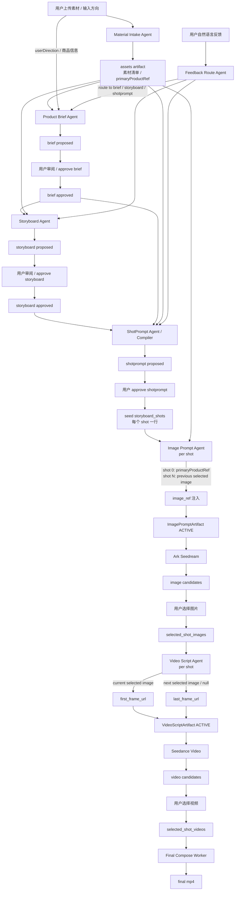

# Agent Workflow

更新时间：2026-05-30

本文用一张图说明当前主 agent 架构的数据流向。整体分为两段：

- Workspace 级 artifact 链路：素材 → brief → storyboard → shotprompt。
- Shot 级候选生成链路：每个 shot 生成图片候选、选择图片、生成视频候选、选择视频，最后合成。

## 关键说明

- `Material Intake Agent` 负责扫描和理解素材，产出 `assets` artifact，后续模块都通过素材 ref 使用它。
- `Product Brief Agent` 基于 `assets` 和用户方向生成商品 brief。当前架构支持通过 `userDirection` 影响 brief，但不支持用户替换主 prompt 模板。
- `Storyboard Agent` 基于 approved brief 和素材生成 storyboard。当前实现还没有把 `userDirection` 透传到 storyboard propose，和 `prompt-api` 文档要求仍有差距。
- `ShotPrompt Agent / Compiler` 把 approved storyboard 转成 shot workflow 的种子，并写入 `storyboard_shots`。
- `Image Prompt Agent` 是 per-shot 模块。shot 0 使用主商品素材作为 `image_ref`，shot N 使用前一 shot 的 selected image 作为场景锚点。
- `Video Script Agent` 是 per-shot 模块。它读取当前 shot selected image 作为 `first_frame_url`，读取下一 shot selected image 作为 `last_frame_url`，最后一个 shot 的 `last_frame_url` 为 `null`。
- `Final Compose Worker` 不重新跑 prompt，只读取当前 `selected_shot_videos` 拼接最终 MP4。
