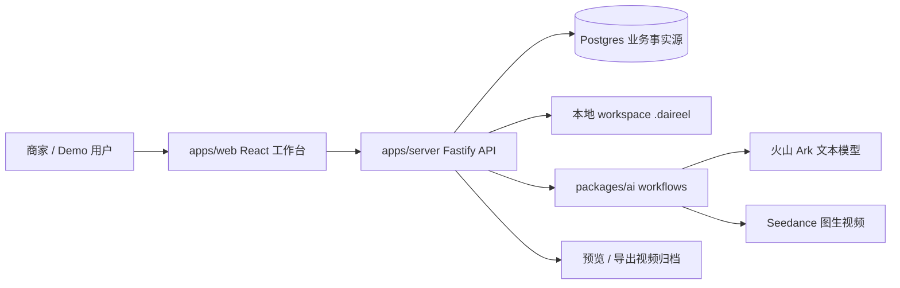
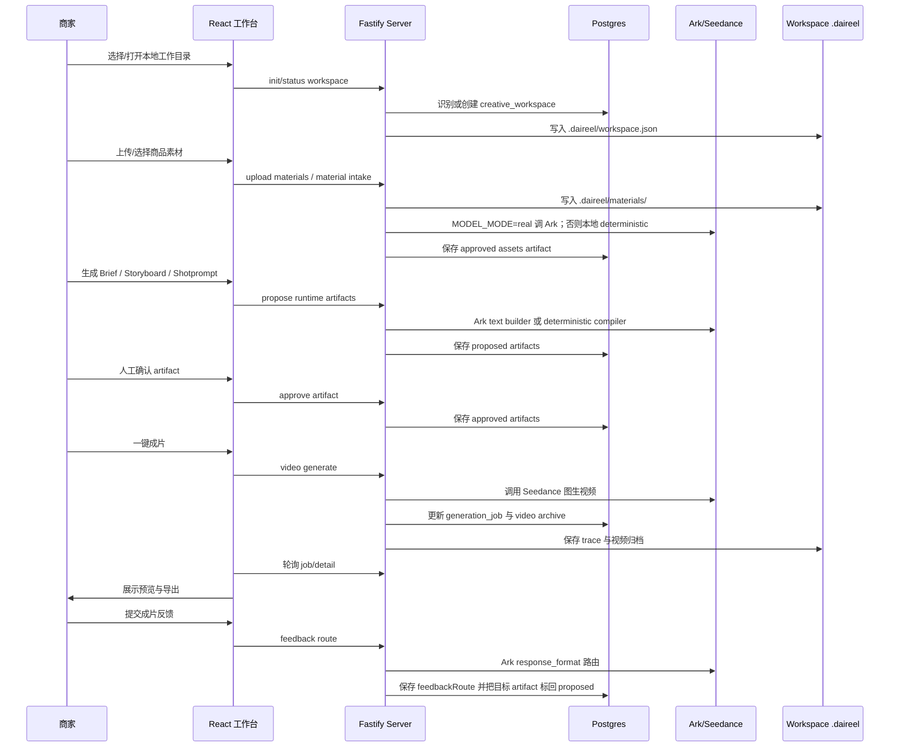

# Daireel 软件设计文档（SDD）

> 基于 `docs/prd_safe.pdf`、`docs/arc_v5.md` 与当前代码整理。
> 目标：在当前 V1 代码架构上，为四人团队提供可执行的功能分工建议；其中 Prompt 设计、Prompt 流转和结构化输出约束是本文重点。

## 1. 项目概述

**项目名称**：Daireel - 电商场景 AIGC 带货视频生成系统

**一句话价值**：帮助商家从商品素材出发，自动生成可解释、可预览、可导出的短视频带货内容。

**P0 必做能力**：

- 商品素材上传。
- 剧本生成。
- 基础分镜。
- 一键成片。
- 任务进度。
- 预览导出。

**当前实现基线**：

- Monorepo：React 前端、Fastify 后端、共享 TypeScript 类型、AI workflow/provider 包。
- Postgres 是业务事实源；workspace `.daireel/` 负责本地恢复、trace、素材托管和视频归档。
- V1 主流程是 workspace pipeline：素材导入 -> 素材理解 -> 商品 brief -> UGC storyboard -> video shotprompt -> Seedance 成片 -> 预览导出与结构化反馈路由。
- V0 `creative-blueprint` / `POST /api/creation/jobs` 已从 active server/web surface 移除；`GeneratedScript` / `CreativeBlueprint` 仅作为 package-level legacy schema、fixture 和兼容测试保留，不参与 V1 workspace prompt 流程。

## 2. 系统架构



### 关键模块

- **apps/web**：V1 workspace UI。用户选择/恢复本地工作目录、导入素材、运行四段 builder、编辑 artifact 表单、查看 PromptPreview、轮询任务进度、预览导出视频。
- **apps/server**：REST API、workspace 编排、Postgres 持久化、成片任务状态、workspace trace、视频归档。
- **packages/ai**：Prompt builders、Ark text provider、Seedance video provider、Ark `response_format` contracts、workflow trace。
- **packages/shared**：跨端类型、Zod schema、DTO、job payload、shotprompt deterministic compiler。
- **Postgres**：products、assets、scripts、storyboard shots、jobs、workspaces、workspace artifacts、video archives。
- **Workspace `.daireel/`**：`workspace.json`、`trace/events.jsonl`、`materials/`、成片归档；它支持恢复和本地资产管理，但不是业务事实源。

### V1 API 表面

- `POST /api/workspaces/directory/select`：打开系统目录选择器。
- `POST /api/workspaces/init`、`POST /api/workspaces/status`：初始化或恢复本地 workspace。
- `POST /api/workspaces/materials`：multipart 上传素材到 `.daireel/materials/`。
- `POST /api/workspaces/material-intake`：运行素材清点。
- `POST /api/workspaces/brief/propose`、`POST /api/workspaces/artifacts/brief/approve`：生成并确认商品 brief。
- `POST /api/workspaces/storyboard/propose`、`POST /api/workspaces/artifacts/storyboard/approve`：生成并确认 UGC 分镜。
- `POST /api/workspaces/shotprompt/compile`、`POST /api/workspaces/artifacts/shotprompt/approve`：生成并确认 video shotprompt。
- `POST /api/workspaces/video/generate`、`GET /api/jobs/:jobId`：启动并轮询成片任务。
- `POST /api/workspaces/feedback/route`：把用户反馈路由到 brief、storyboard 或 shotprompt。
- `GET /api/pipeline/contracts`：只读返回 V1 pipeline contracts。

## 3. 主流程设计



### Artifact 边界

- 素材清点产出 `assets` artifact，并在当前实现中直接标记为 `approved`。
- `brief`、`storyboard`、`shotprompt` 先以 `proposed` 状态保存，再由用户人工确认成 `approved`。
- 成片只消费 approved `ShotPromptArtifact`；最终 Seedance prompt 不从 V0 `GeneratedScript` 生成。
- 用户反馈会通过 Ark structured output 生成 `feedbackRoute` artifact，包含 `targetArtifact`、`reason`、`revisionInstruction` 和 `confidence`。
- 反馈路由器只负责判断反馈应回到 `brief`、`storyboard` 或 `shotprompt`；它不会直接改写 artifact 字段。后端会把目标 artifact 标记回 `proposed`，供对应 builder 或人工表单继续修改。

### Workspace 状态

当前 workspace 状态包括：

```text
draft -> materials_ready -> brief_proposed -> brief_approved
-> storyboard_proposed -> storyboard_approved
-> shotprompt_proposed -> shotprompt_approved
-> video_generating -> video_ready
```

异常/恢复状态包括 `failed` 和 `missing`。`nextAction` 会根据状态返回下一步 endpoint、actionType、runtimeMode、provider 和是否需要人工确认。

### 数据与文件边界

- Postgres 负责所有可恢复业务事实：workspace、artifact、script、job、asset、video archive。
- Workspace 本地文件负责素材、manifest、trace 和视频归档。
- 上传素材进入 `.daireel/materials/`；导入既有目录时，如果 managed materials 为空，系统可扫描根目录素材作为候选。
- Deprecated repo-local `storage/trace` 不作为当前系统期望的业务 trace 来源。

### Runtime Mode

- `MODEL_MODE=real`：V1 text builders 调用 Ark text provider；Seedance 成片调用真实 video provider。
- 非 real：使用 deterministic/local builder；前端 `promptView.provider` 标记为 `deterministic`。
- 不论 runtime mode，Seedance-facing prompt 都必须以中文构建。

## 4. Prompt 架构、五个主链路与反馈路由

本节按 `packages/ai/src/contracts/pipeline.contracts.ts` 记录当前 prompt 设计：五个主生成/导出链路，加上成片后的 `feedback_route`。Prompt 调试时必须区分三层内容：

- **前端 PromptPreview**：后端返回 `RuntimePromptView`，前端展示 `RuntimePromptView.nl.sections`。它面向商家和调试者，说明当前 builder 会做什么。
- **Ark builder prompt**：`MODEL_MODE=real` 时传给 Ark Chat Completions 的真实文本或多模态 content。它由 `build*Prompt()` 构建。
- **Seedance video export prompt**：最终传给 Seedance 图生视频 provider 的完整中文 prompt。它由 approved `ShotPromptArtifact` 编译而来。

### Prompt 规则

- Seedance-facing prompt 必须中文构建。
- UI preview、builder prompt、repair prompt 应尽量中文化，避免让调试 trace 看起来像英文 prompt 仍在生效。
- JSON 字段名、enum、schema key 保持英文，因为 parser、Zod schema 和 Ark `response_format` 依赖这些机器契约。
- Ark 文本 builder 的结构约束以 `packages/ai/src/contracts/response-formats.ts` 为准；prompt 中的 JSON 示例只是模型说明。
- `response_format` 只接入 Ark text builders；Seedance 视频生成不是 Chat structured output，不使用 `response_format`。

### Structured Output 与 Trace

- V1 Ark 文本链路 `material_intake`、`product_brief`、`storyboard`、`shotprompt`、`feedback_route` 都使用 strict JSON Schema `response_format`。
- `response_format` 的统一接入点是 `packages/ai/src/providers/ark-text.provider.ts` 的 `generateTextWithArk()`。
- `response_format` schema 定义在 `packages/ai/src/contracts/response-formats.ts`，包括 `material_intake_v1`、`product_brief_v1`、`ugc_storyboard_v1`、`video_shotprompt_v1`、`feedback_route_v1`。
- 后端 trace 会记录 request prepared、provider request/response、parse/repair 状态。调试 prompt 问题时应同时看 UI `promptView`、workspace trace 和 provider request body。

### 4.1 Material Intake

- **Contract**：`material_intake`
- **Version**：`material-intake.v1`
- **Provider**：Ark text in `MODEL_MODE=real`; deterministic/local scan otherwise
- **PromptView Builder**：`buildMaterialIntakePromptView`
- **Provider Prompt Builder**：`buildMaterialIntakePrompt`
- **Response Format**：`material_intake_v1`
- **Source**：`packages/ai/src/prompts/material-intake.prompt.ts`

`buildMaterialIntakePromptView` 返回给前端展示，包含角色、用户意图、已选择素材清单、任务、输出契约。它和真实 provider prompt 使用同一批输入，但不是同一个字符串。

`buildMaterialIntakePrompt` 是 real mode 传给 Ark 的真实 builder prompt：

```text
角色：
你是素材清点标签构建器。你会为已验证的工作区文件打标，供电商视频生成使用。

输入：
用户初始意图：{{initialPrompt | "未指定"}}
已验证素材清单：
{{JSON.stringify(scanned.assets)}}
被拒绝文件，仅作背景信息。不要把这些文件写入 tags：
{{JSON.stringify(scanned.rejected)}}
文本预览：
{{JSON.stringify(textPreviews ?? [])}}

任务：
为每个已验证素材选择 role、description、relevance 和 included。
存在有效商品图片时，优先选择一张图片作为 primaryProductRef。
不要编造 ref，必须逐字使用已验证素材清单中的 ref。
不要生成商品 brief、开场钩子、分镜或视频生成提示词。

输出：
返回严格 JSON，匹配以下结构，不要包含 Markdown：
{
  "primaryProductRef": "product.png",
  "tags": [
    {
      "ref": "product.png",
      "role": "product_main",
      "description": "简短事实描述",
      "relevance": "high",
      "included": true
    }
  ]
}
```

输出落库为 `type: "assets"`、`status: "approved"` 的 workspace artifact。

### 4.2 Product Brief

- **Contract**：`product_brief`
- **Version**：`product-brief.v1`
- **Provider**：Ark text in `MODEL_MODE=real`; deterministic `toProductBrief` otherwise
- **PromptView Builder**：`buildProductBriefPromptView`
- **Provider Prompt Builder**：`buildProductBriefPrompt`
- **Response Format**：`product_brief_v1`
- **Source**：`packages/ai/src/prompts/product-brief.prompt.ts`

点击“生成 Brief”时，前端调用 `POST /api/workspaces/brief/propose`。后端读取 approved `assets` artifact，构建 `RuntimePromptView` 供前端展示；real mode 调用 `generateProductBriefWithArk()`，并把 `product_brief_v1` 作为 Ark `response_format` 传入。

`buildProductBriefPrompt` 的真实 provider prompt：

```text
角色：
你是电商商品简报构建器。你要生成商家可编辑的商品 brief，不要生成开场钩子、分镜或最终视频提示词。

输入：
用户方向：{{userDirection | "未指定"}}
{{legacySeed(title, sellingPoints, audience, stylePreference)}}
主商品素材 ref：{{material.primaryProductRef}}
可用素材清单：
{{JSON.stringify(material.assets)}}

任务：
为一条电商短视频生成一份简洁商品 brief。
只选择一个 coreSellingPoint。
product.assets 中的 ref 只能来自素材清单。
不要写开场钩子、分镜节拍、口播、CTA 文案或图生视频提示词。
如果事实没有被输入直接支持，必须写入 assumptions。

输出：
返回严格 JSON，匹配以下结构，不要包含 Markdown：
{
  "product": {
    "name": "字符串",
    "category": "字符串",
    "keyFacts": ["字符串"],
    "assets": [{ "ref": "product.png", "useAs": "primary | support" }]
  },
  "audience": {
    "who": "字符串",
    "painOrDesire": "字符串"
  },
  "coreSellingPoint": "单个字符串",
  "proof": ["字符串"],
  "offer": null,
  "platform": "Seedance",
  "brandTone": "字符串",
  "bannedExpressions": ["字符串"],
  "landingInfo": null,
  "assumptions": ["字符串"]
}
```

产品 brief repair prompt：

```text
请把以下模型输出修复为符合商品 brief schema 的严格 JSON。
必须只保留一个 coreSellingPoint 字符串。
不要添加开场钩子、分镜节拍、口播、CTA 文案或图生视频提示词。
不要包含 Markdown。

{{rawOutput}}
```

输出先落库为 `type: "brief"`、`status: "proposed"`；用户确认后才变成 approved，供 storyboard 使用。

### 4.3 UGC Storyboard

- **Contract**：`storyboard`
- **Version**：`ugc-storyboard.v1`
- **Provider**：Ark text in `MODEL_MODE=real`; deterministic `toStoryboard` otherwise
- **PromptView Builder**：`buildStoryboardPromptView`
- **Provider Prompt Builder**：`buildStoryboardPrompt`
- **Response Format**：`ugc_storyboard_v1`
- **Source**：`packages/ai/src/prompts/storyboard.prompt.ts`

Storyboard builder 只生成可编辑 UGC 分镜 artifact，不生成 Seedance provider prompt，也不生成最终视频提示词。

`buildStoryboardPrompt` 的真实 provider prompt：

```text
角色：
你是电商口播分镜构建器。你要把一份已确认商品 brief 转成商家可编辑的短视频分镜。

输入：
已确认商品 brief：
{{JSON.stringify(brief)}}
已确认素材清单：
{{JSON.stringify(material.assets)}}

任务：
只生成一条电商短视频分镜。
忠实保留 brief 中唯一的 coreSellingPoint，不要引入新的商品主张。
每个 shots[].purpose 必须严格是 hook、benefit、proof、cta 之一，不要使用自然语言目的标签。
每个 shots[].productAssetRef 必须是已确认素材清单中的非空 ref。
productAssetRef 只能使用已确认素材清单里的值。
如果只有一个纳入生成的素材 ref，每个 shot 都使用该 ref。
为每个 shot 写自然的创作者口播。
不要要求生成视频里出现可读文字。
不要写 Seedance 图生视频提示词或最终 provider prompt 字符串。

输出：
返回严格 JSON，匹配以下结构，不要包含 Markdown：
{
  "narrative": "字符串",
  "totalDurationSec": 12,
  "shots": [
    {
      "index": 0,
      "purpose": "hook",
      "durationSec": 3,
      "scene": "字符串",
      "visualDirection": "字符串",
      "productAssetRef": "product.png",
      "voiceover": "字符串",
      "transition": "cut"
    }
  ],
  "assumptions": ["字符串"]
}
```

输出先落库为 `type: "storyboard"`、`status: "proposed"`；用户确认后供 shotprompt 使用。

### 4.4 Video Shotprompt

- **Contract**：`shotprompt`
- **Version**：`video-shotprompt.v1`
- **Provider**：Ark text in `MODEL_MODE=real`; deterministic compiler otherwise
- **PromptView Builder**：`buildShotPromptPromptView`
- **Provider Prompt Builder**：`buildShotPromptPrompt`
- **Deterministic Builder**：`packages/shared/src/shotprompt/compiler.ts`
- **Response Format**：`video_shotprompt_v1`
- **Source**：`packages/ai/src/prompts/shotprompt.prompt.ts`

Shotprompt 是 V1 里 Seedance 前的最后一个可编辑 artifact。real mode 通过 Ark 生成 `ShotPromptArtifact`；mock/default mode 从 approved storyboard 确定性编译 `ShotPromptArtifact`。

真实 provider 模式的 Ark prompt：

```text
角色：
你是 Seedance 图生视频提示词构建器。你要把已确认分镜转成一份商家可编辑、可传给 provider 的 shotprompt artifact。

输入：
画幅比例：{{aspectRatio}}
已确认商品 brief：
{{JSON.stringify(brief)}}
已确认素材清单：
{{JSON.stringify(material.assets)}}
已确认分镜：
{{JSON.stringify(storyboard)}}

任务：
生成面向 Seedance 的 shotprompt artifact，必须准确保持被引用商品。
referenceAssetRefs 只能来自已确认素材清单。
保持分镜时间和口播对齐。
V1 不生成字幕，不要把可读文字作为视频生成要求。
启用 tts，并从 shots[].voiceover 汇总完整 voiceover。tts 是渲染计划/结果，不是第二份可编辑脚本。
不要改变上游商品主张或目标人群。

输出：
返回严格 JSON，匹配以下结构，不要包含 Markdown：
{
  "targetProvider": "seedance",
  "durationSec": 12,
  "aspectRatio": "{{aspectRatio}}",
  "prompt": "字符串",
  "negativePrompt": "字符串",
  "shots": [
    {
      "index": 0,
      "startSec": 0,
      "endSec": 3,
      "providerPrompt": "字符串",
      "referenceAssetRefs": ["product.png"],
      "voiceover": "字符串"
    }
  ],
  "tts": {
    "enabled": true,
    "source": "shots.voiceover",
    "voiceover": "字符串"
  },
  "assumptions": ["字符串"]
}
```

默认/非 real 模式的确定性编译模板：

```text
{{storyboard.totalDurationSec}} 秒 {{aspectRatio}} 电商 UGC 视频。
{{storyboard.narrative}}
{{startSec}}-{{endSec}} 秒 {{purposeLabel}}：{{scene}}。{{visualDirection}}。参考素材：{{productAssetRef}}。
...

negativePrompt: 低质量，商品变形，不可读文字
tts.voiceover: {{storyboard.shots[].voiceover joined with spaces}}
assumptions: 已从通过审核的分镜确定性编译。
```

输出先落库为 `type: "shotprompt"`、`status: "proposed"`；用户确认后才允许启动成片。

### 4.5 Seedance Video Export

- **Contract**：`video_export`
- **Version**：`seedance-video-export.v1`
- **Provider**：Seedance video
- **Builder**：`buildSeedanceVideoExportPrompt`
- **Prompt Source**：approved `ShotPromptArtifact`
- **Source**：`packages/ai/src/prompts/video.prompt.ts`、`apps/server/src/jobs/processors/media-generate.processor.ts`

Seedance Video Export 不是 Ark text builder，不使用 Chat `response_format`。它只消费 approved `ShotPromptArtifact`，把 `shotprompt.prompt`、`shotprompt.negativePrompt`、`tts.voiceover` 和每个镜头的 `shots[].providerPrompt` 编进最终 provider prompt。

V0 `GeneratedScript` / `CreativeBlueprint` 仍有 deprecated legacy prompt builder，但 V1 workspace video export 不应使用它。调试“视频剧本一栏 shot 内容是否进入 Seedance prompt”时，应检查 approved `ShotPromptArtifact.shots[].providerPrompt` 是否进入最终 prompt 的“逐镜头时间线”。

最终 Seedance prompt 模板：

```text
生成一条完整的 Seedance 图生视频，必须以已批准的视频剧本为事实源。
视频规格：总时长 {{shotprompt.durationSec}} 秒，画幅 {{shotprompt.aspectRatio}}，目标 provider 为 Seedance。

主创意约束：
{{shotprompt.prompt}}

商品与素材约束：
以输入商品图片和每个镜头的引用素材作为商品外观事实源。
引用素材：{{unique(shots[].referenceAssetRefs)}}。
必须保持商品的形状、颜色、材质、Logo、包装和关键细节一致；不要生成新的商品部件、额外品牌或可读文字。

逐镜头时间线：
{{index + 1}}. {{shot.startSec}}-{{shot.endSec}} 秒：{{shot.providerPrompt}}
   引用素材：{{shot.referenceAssetRefs}}
   口播：{{shot.voiceover}}
...

口播参考：
{{shotprompt.tts.voiceover}}

禁止项：
{{shotprompt.negativePrompt}}

生成要求：生成一条连续完整视频，不要拆成多个拼接片段；镜头过渡自然，节奏稳定，商品始终清晰可信。
```

### 4.6 Feedback Route

- **Contract**：`feedback_route`
- **Version**：`feedback-route.v1`
- **Provider**：Ark text in `MODEL_MODE=real`; deterministic route only in mock/test mode
- **PromptView Builder**：`buildFeedbackRoutePromptView`
- **Provider Prompt Builder**：`buildFeedbackRoutePrompt`
- **Response Format**：`feedback_route_v1`
- **Source**：`packages/ai/src/prompts/feedback-route.prompt.ts`

成片反馈路由不是旧的关键词改写链路。Real mode 下后端会把用户反馈、approved brief、approved storyboard 和 approved shotprompt 一起传给 Ark，并要求模型用 `feedback_route_v1` strict JSON Schema 返回路由决策。关键词规则只保留在非 real 模式，作为本地测试兜底。

真实 provider prompt：

```text
角色：
你是成片反馈路由器。你只判断用户反馈应该回到哪个已批准 artifact，不直接改写 brief、storyboard 或 shotprompt。

路由分类：
1. 回到 brief：卖点选错、受众不对、痛点不准、价格优惠、平台、品牌语气、踩禁用词。
2. 回到 storyboard：创作者角色不合、口播不像真人、Hook 不抓人、脚本节奏、CTA 软硬、字幕或口播文案问题。
3. 回到 shotprompt：商品不像原图、镜头运动、商品运动、演示动作、时长、结尾定格、负向约束或画面违规。
反馈含多类问题时，选择最上游的 artifact，避免下游修改被上游重生成覆盖。

用户成片反馈：
{{feedback}}

当前 brief 摘要：
{{JSON.stringify(summarizeBrief(brief))}}

当前 storyboard 摘要：
{{JSON.stringify(summarizeStoryboard(storyboard))}}

当前 shotprompt 摘要：
{{JSON.stringify(summarizeShotPrompt(shotPrompt))}}

输出要求：
返回严格 JSON，不要包含 Markdown。
reason 和 revisionInstruction 必须使用中文。
revisionInstruction 是给目标 builder 或人工编辑表单看的修改指令，不要直接生成新的 artifact 内容。
{
  "targetArtifact": "brief | storyboard | shotprompt",
  "reason": "中文路由原因",
  "revisionInstruction": "中文修改指令",
  "confidence": "high | medium | low"
}
```

输出落库为 `type: "feedbackRoute"`、`status: "approved"` 的 workspace artifact。后端随后把目标 artifact 的当前数据保持不变、状态标记为 `proposed`，避免路由器用一句反馈直接覆盖已确认事实。

## 5. 四人功能分工推荐

> 推荐按功能闭环分工，而不是纯前后端分层。每位工程同学都对自己负责的用户路径有清晰验收标准，降低联调成本。

| 成员 | 推荐角色 | 功能职责 | 核心交付 |
| --- | --- | --- | --- |
| 队友 A | 全栈工程师：素材与 workspace 负责人 | 负责 workspace 初始化/恢复、`.daireel/materials/` 上传与素材库、material intake、workspace 状态机、Postgres 清理与测试数据治理 | 稳定的素材入口、workspace 可恢复状态、approved assets artifact、清库脚本与相关 API 测试 |
| 队友 B | 全栈工程师：AI 生成与成片负责人 | 负责 brief/storyboard/shotprompt workflow、反馈路由 workflow、中文 prompt 合约、Ark `response_format`、Seedance provider、任务队列、成片归档、生成失败诊断 | 可解释剧本与分镜、Seedance-ready `ShotPromptArtifact`、一键成片链路、结构化反馈路由、provider trace 与失败兜底 |
| 队友 C | 前端工程师：商家工作台负责人 | 负责 React V1 工作台、四段 builder UI、artifact 表单、`RuntimePromptView` 展示、任务进度轮询、预览导出、反馈入口与路由结果展示 | 可演示端到端 UI、清晰状态反馈、PromptPreview、视频预览导出、前端 API 集成测试 |
| 队友 D | 设计师：产品体验与提报负责人 | 负责用户路径、信息架构、视觉规范、演示脚本、答辩材料、截图与业务价值表达 | 低摩擦 demo 动线、页面视觉稿、交互说明、项目提报材料与演示视频脚本 |

### 功能边界

- **素材与 workspace**：从用户进入项目、选择工作目录、上传/选择素材，到素材被结构化为可消费 artifact。
- **AI 生成与成片**：从 approved material/brief/storyboard 到 approved shotprompt，再到 Seedance 成片和结果归档。
- **商家工作台**：把后端状态、prompt preview 与 artifact 组织成可理解、可操作、可恢复的界面。
- **产品体验与提报**：确保评委能在最短路径内理解业务价值、核心流程和技术亮点。

### 协作接口

- 队友 A 和队友 B 以 `workspace_artifact` schema 作为交接边界。
- 队友 B 和队友 C 以 `apps/web/src/lib/api/client.ts` 的 typed API、`RuntimePromptView` 和 job detail shape 作为交接边界。
- 队友 D 和队友 C 以页面状态清单、关键文案、截图标注、演示路径作为交接边界。
- 全员以 `CONTEXT.md` 的领域词汇为命名标准，避免“素材”“剧本”“分镜”“成片任务”语义漂移。

## 6. 里程碑建议

### Milestone 1：P0 链路冻结

- 素材上传/导入稳定进入 `.daireel/materials/` 或被根目录 fallback 识别。
- 生成素材清点，并依次确认 brief、storyboard、shotprompt artifacts。
- 一键成片可创建 job、调用 mock 或 real Seedance、轮询完成。
- 前端能从空 workspace 跑完完整 demo，并展示 prompt preview。

### Milestone 2：Demo 可复核

- 清理旧 Postgres 数据后可重复跑新版本测试。
- README/SDD/架构说明与实际 UI、prompt 流转一致。
- 前端展示 jobId、scriptId、workspaceId、provider、runtimeMode、错误信息等必要诊断信息。
- 准备 1 条端到端生成结果与演示视频。

### Milestone 3：加分项收敛

- 失败重试、反馈后自动重跑目标 builder、Mock 数据看板、分镜局部重生成择优推进。
- 保持 P0 主链路稳定，不为 P1/P2 破坏主 demo。

## 7. 测试策略

- **后端 API 测试**：覆盖 workspace init/status/material/brief/storyboard/shotprompt/video generate/job detail/feedback route，并验证 real mode provider request body 包含 Ark `response_format`。
- **AI workflow 测试**：覆盖 structured output、repair、中文 prompt、provider request trace、feedback route JSON schema、`shots[].providerPrompt` 进入 final Seedance prompt。
- **前端渲染测试**：覆盖 workspace shell、builder cards、`RuntimePromptView` / PromptPreview、任务进度、视频预览。
- **端到端手测路径**：
  1. 清空 Postgres 或选择新 workspace。
  2. 选择/打开工作目录。
  3. 上传商品素材，确认进入 `.daireel/materials/`。
  4. 生成素材清点，并依次生成/确认商品 brief、UGC storyboard、video shotprompt。
  5. 检查 PromptPreview 与 workspace trace 中的 prompt 内容。
  6. 一键成片。
  7. 查看任务进度、预览视频、导出结果。

## 8. 风险与约束

- Seedance 真实生成质量不稳定时，必须保留 mock/fallback 演示路径。
- 当前 V1 是单 current creative line；多版本对比与复杂分镜编辑不进入 P0 主路径。
- Workspace trace 保存在用户工作目录，复用同一目录时旧 trace 可能继续存在；新版本测试建议使用新 workspace 或显式处理该 workspace trace。
- 英文字段名、enum、schema key 不属于“英文 prompt 问题”，它们是 parser、Zod schema 和 `response_format` 依赖的机器契约。
- P0 不承诺真实 TTS、字幕、BGM、复杂剪辑、向量检索和真实数据看板，除非主链路已稳定。

## 9. 参考文档

- `docs/prd_safe.pdf`：比赛 PRD 与提交要求。
- `docs/arc_v5.md`：当前 V1 代码架构与模块职责。
- `CONTEXT.md`：领域词汇与边界。
- `docs/erd.md`：Postgres 数据模型。
- `packages/ai/src/prompts/*.prompt.ts`：V1 prompt builders、feedback route prompt 与 package-level legacy prompt。
- `packages/ai/src/contracts/response-formats.ts`：Ark structured output `response_format` 定义。
